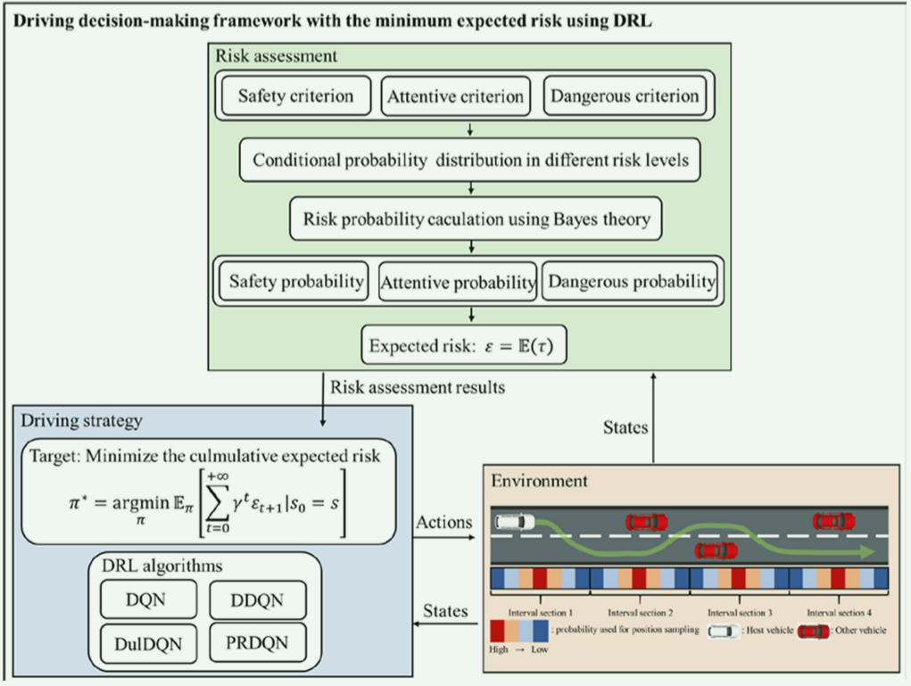
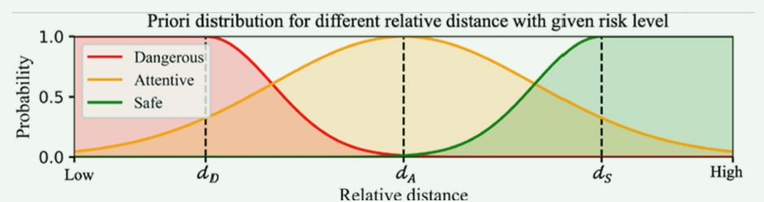
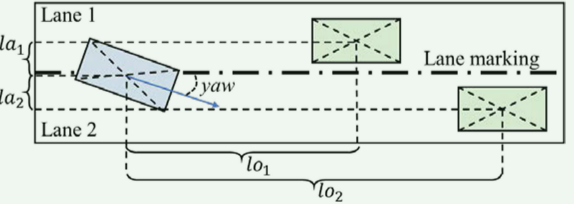
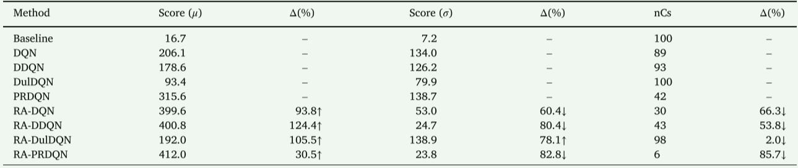
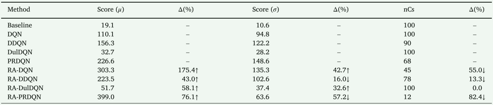

# Decision making of autonomous vehicles in lane change scenarios: Deep reinforcement learning approaches with risk awareness

# 自动驾驶汽车变道场景下的决策: 具有风险意识的深度强化学习方法

\[TOC]

## 摘要

*   提出了一种基于深度强化学习的变道决策框架，以寻求一种具有风险意识、期望风险最小的自动驾驶变道决策策略。首先，提出了一种基于概率模型的驾驶风险评估方法，利用位置不确定性和基于距离的安全性指标对驾驶风险进行评估。在此基础上，提出了一种基于深度强化学习的风险感知决策算法，以寻求期望风险最小的策略。最后，在 CARLA 环境下，分别对静态障碍物和动态移动车辆两种情况下提出的方法进行了评估。

*   关键词：驾驶安全、驾驶风险、无人驾驶汽车、驾驶员辅助系统、强化学习

*   期刊：Transportation Research Part C-emerging Technologies. SCIE Q1

*   作者：

    1.  [李国发 重庆大学 教授](https://faculty.cqu.edu.cn/GuofaLi/en/index.htm)
    2.  [李深 Ph.D of University of Wisconsin–Madison](https://www.imem.tsinghua.edu.cn/info/1333/3255.htm)
    3.  [曲行达 深圳大学 教授 Ph.D of Virginia Tech](https://cmce.szu.edu.cn/info/1607/4341.htm)
    4.  [吕能超 武汉理工大学 教授](http://its.whut.edu.cn/?jiaoshifengcai/859.html)
    5.  [李升波 清华大学 教授](https://www.svm.tsinghua.edu.cn/essay/80/1812.html)

## 研究背景与目的

*   近年来，随着智能交通系统（ITS）的快速发展，大量的驾驶安全应用被应用于高级驾驶员辅助系统（ADAS）和自动驾驶汽车（AV）中，以帮助驾驶员做出避碰决策。

*   现有的驾驶决策方法主要分为三类：

    *   基于运动规划的方法

        *   传统的基于运动规划的方法通常受到机器人运动规划算法的启发，如 A\* 和 人工势场 APF。

            *   然而这种方法严重依赖于图的生成方式（不违反物理约束），并且没有充分考虑车辆动力学，因此生成的路径可能与动力学不兼容

        *   将车辆动力加入考虑，开发了另一种解决方法，如 Wang (2019)中着眼于驾驶过程中不可避免的碰撞情况。 使用模型预测控制进行运动规划，以避免碰撞或减轻碰撞严重程度。

            *   这些方法的局限性在于，运动规划中使用的一些运动约束通常是非线性和非凸的，这可能会导致 NP 困难（非确定性多项式时间困难）问题。

    *   基于风险评估的方法

        *   基于风险评估的方法通常采用以下两个步骤来保证驾驶安全：

            *   评估当前驾驶状态的风险，
            *   根据风险评估结果制定顺序行动策略以维护安全。

        *   这种分层解决方案使得基于风险评估的方法在自动驾驶汽车和 ADAS 的实际应用中更容易模块化。

        *   目前，通常使用两类方法进行风险评估，包括确定性方法和概率性方法。

        *   确定性方法

            *   确定性方法是一种二元预测方法，仅估计潜在碰撞是否会发生。
            *   传统上，研究人员使用特定的安全指标来评估风险，例如碰撞时间 (TTC)、制动时间 (TTB) 或车头时距 (THW).并通过将获得的安全指标值与预定义的阈值进行比较来评估潜在风险。
            *   这些方法几乎没有计算负担，可以准确评估单车道场景下纵向驾驶的威胁风险。
            *   然而，它们在多车道场景中的表现大多不令人满意，并且没有考虑输入数据的不确定性，使得派生的策略对于现实应用来说并不实用。

        *   概率性方法

            *   概率方法避免了上述不确定性问题，通常利用概率描述，通过使用车辆之间的时间和空间关系以及输入数据的不确定性来对风险水平进行建模。
            *   Noh (2019) and Noh and An (2018) 使用贝叶斯模型将常规指标（例如 TTC）纳入风险概率评估中，然后开发基于规则的专业系统来控制目标车辆在十字路口和高速公路上行驶。
            *   Yu (2018) 将车辆建模为粒子，通过其运动学传播粒子，并使用传播过程中粒子的分布作为避免碰撞的风险分布。
            *   Shin (2019)引入了车辆间通信来预测具有不确定性的远程车辆位置，并使用不确定性边界内的碰撞案例数量来评估风险概率。
            *   概率方法的一个常见局限性是它们仅使用专家知识来生成基于规则的动作，在环境干扰中无法做出正确的决策，并且忽略了人类驾驶员在驾驶中的学习特性。

    *   基于学习的方法

        *   监督学习

            *   Codevilla et al.（2018）提出了一种条件模仿学习方法，用于生成司机的驾驶策略，以处理感觉运动协调。在实验中，对导航命令的持续反应有助于做出成功避开障碍物的决定。
            *   Xu 等人（2017）使用长短时记忆架构对单目摄像机的瞬时观测值和之前的车辆状态进行编码，然后基于大规模视频数据集对他们的网络进行训练，以模拟驾驶员的真实行为。
            *   这些方法都是端到端的方式，受益于监督学习的最大优点，即通过使用所开发的网络可以直接映射传感器输入和模型输出之间的关系。
            *   此外，监督学习方法可以使网络产生逼真的人类驾驶员行为。

        *   强化学习

            *   DRL 方法 可以大大降低对大量数据的严重依赖，同时，他们可以通过反复试错（via trial and error）来学习和提高驾驶知识和技能，这意味着可以在撞车或接近撞车的情况下使用基于 DRL 的方法来帮助 AV 避免撞车
            *   Long (2018) 提出了一种基于 DRL 的系统级方案，使多智能体能够在不观察其他智能体状态和意图的情况下规划自己的无冲突行动。
            *   Moghadam 和 Elkaim (2019) 将 DRL 引入了分层体系结构，以做出连续的策略决策（tactical decision），随后将车辆的策略决策转化为车辆控制的低级动作。
            *   与监督学习方法不同，基于 DRL 的方法可以通过在虚拟仿真环境中训练模型来补偿危险场景中数据收集的高成本，并且具有可负担的试错。
            *   许多基于 DRL 的决策方法没有充分考虑驾驶风险，导致学习到风险不敏感的驾驶策略，无法保证车辆安全行驶
            *   Kahn（2017）提出了一种不确定性感知的强化学习算法，通过使用不确定性来估计驾驶风险来学习避障策略。
            *   Bouton（2019）提出了一种基于概率保证的交叉口自主驾驶强化学习策略，通过使用线性时序逻辑表达的期望概率规范来约束智能体的行为
            *   Mokhtari and Wagner（2021）开发了一个基于风险的决策框架，该框架将基于风险的路径规划与基于强化学习的安全驾驶控制相结合。
            *   尽管一些基于 DRL 的决策方法已经考虑了风险评估，但对变道场景下自动驾驶的风险评估考虑仍需进一步研究。

    *   具体工作

        *   提出了一种利用贝叶斯理论基于位置不确定性的量化方法来评估驾驶风险。
        *   使用 DRL 学习风险最小的策略。
        *   在 CARLA 的各种场景中进行方法的有效性评估

    ***

    ## 问题陈述和现有解决方案

    *   在基于 DRL 的决策策略中，智能体可以在随机环境中通过在一系列时间步骤上选择一系列动作来行动，然后从反馈（奖励）中学习以最大化累积奖励。

        *   该过程通常被建模为马尔可夫决策过程（MDP），一个 MDP 定义为元组 $(\mathcal{S},\mathcal{A},\mathcal{P},\mathcal{R},\gamma)$ ：

            *   $\mathcal{S}$

                是有限状态的集合

            *   $\mathcal{A}$

                ​ 是有限动作的集合

            *   $\mathcal{P}$

                是状态转移矩阵 $\mathcal{P}_{\mathrm{ss}^{\prime}}^a=\mathbb{P}[\mathcal{S}_{t+1}=s^{\prime}|\mathcal{S}_t=s,\mathcal{A}_t=a]$

            *   $\mathcal{R}_S$

                是奖励函数，$\mathcal{R}_s^a=\mathbb{E}[R_{t+1}|\mathcal{S}_t=s,\mathcal{A}_t=a]$

            *   $\gamma$

                是折扣因子，$\gamma \in [0,1]$

        *   策略 π，表示输入状态为 s 的情况下采取动作 a 的概率$π(a|s)= P[\mathcal{A}_t = a|\mathcal{S}_t =s]$​

        *   MDP 的解决方案是找到一个可以最大化期望累积奖励的最佳策略 π\*(s)

        *   可以引入 Q 值函数来指导策略改进并代表策略本身$q_\pi(s,a)=\mathbb{E}_\pi[R_{t+1}+\gamma q_\pi(S_{t+1},A_{t+1})|S_t=s,A_t=a]$$\pi'(s)=\arg\max_{a\in\mathcal{A}}^{\pi}(q_\pi(s,a))$

        *   最大化 Q 值函数来找到最佳策略$q_*(s,a)=\max_\pi q_\pi(s,a)$

    *   DQN 系列：

        *   DQN (Deep Q-Network)

            *   DQN 将深度学习与 Q-learning 结合，利用深度神经网络来近似状态-动作值函数（Q 函数）。这种方法能够在高维输入（如图像）下有效地学习策略，在 Atari 游戏中的表现尤为出色

            *   DQN 的关键特性和技术：

                *   Q-learning: DQN 基于 Q-learning 算法，该算法的核心是学习一个 Q 函数 $Q(s, a)$，表示在状态$s$选择动作$a$​ 后的预期回报。目标是使得这个 Q 函数逼近真实的 Q 值。

                *   经验回放：为了减少样本间的相关性和提高数据利用率，DQN 使用经验回放机制。训练过程中，代理在与环境交互时，会将其经历的（状态，动作，奖励，下一个状态）四元组存储在经验回放缓冲区中，然后从中随机抽取小批量样本用于更新神经网络参数。

                *   目标网络：DQN 使用一个目标网络来计算目标 Q 值，这个目标网络的参数是定期从主 Q 网络复制而来。目标网络的存在减少了训练过程中 Q 值目标的快速变化，从而提高了训练的稳定性。

            *   DQN 算法的核心公式： $Q(s, a) \leftarrow Q(s, a) + \alpha \left[ r + \gamma \max_{a'} Q(s', a') - Q(s, a) \right]$

                *   其中，$r$是即时奖励，$\gamma$是折扣因子，$\alpha$是学习率，$s'$是下一个状态，$a'$是下一步的动作。

        *   DDQN (Double DQN)

            *   DDQN（双深度 Q 网络）是对 DQN 的改进，旨在解决 DQN 中的过估计（overestimation）问题。

            *   过估计问题是指在 Q-learning 中，由于最大化操作可能会导致 Q 值的估计偏差，这种偏差会使得算法倾向于高估某些动作的价值，从而影响策略的学习。

            *   DDQN 的主要改进：

                *   动作选择与 Q 值更新的分离: 在 DDQN 中，动作选择仍然由主 Q 网络执行，而 Q 值的计算则使用目标网络。这种方法的核心思想是通过分离动作选择和 Q 值更新来减少最大化操作带来的偏差

            *   DDQN 算法的核心公式： $Q(s, a) \leftarrow Q(s, a) + \alpha \left[ r + \gamma Q_{\text{target}}(s', \text{argmax}_{a'} Q(s', a')) - Q(s, a) \right]$

                *   其中，$Q_{\text{target}}$是目标网络的 Q 值估计，$\text{argmax}_{a'} Q(s', a')$是由主网络选择的动作。

        *   Dueling Deep Q-Network（DulDQN）

            *   **Dueling Deep Q-Network**（对抗深度 Q 网络）是一种对 DQN 结构的改进方法，旨在更好地估计 Q 值函数，从而提高学习效率和策略质量。

            *   Dueling DQN 的核心思想：

                *   Q 值函数的分解: Dueling DQN 将 Q 值函数分解为两个部分：状态值函数 $V(s)$和优势函数$A(s, a)$。状态值函数表示在给定状态下的期望总回报，而优势函数则表示在特定状态下选择某个动作相对于其他动作的好坏程度。

            *   Dueling DQN 的输出结构有两个分支：一个用于估计状态值函数 $V(s)$，另一个用于估计优势函数 $A(s, a)$。然后，这两个分支的输出组合起来形成最终的 Q 值：$Q(s, a; \theta, \alpha, \beta) = V(s; \theta, \beta) + \left( A(s, a; \theta, \alpha) - \frac{1}{|\mathcal{A}|} \sum_{a'} A(s, a'; \theta, \alpha) \right)$

                *   其中，$\theta$是共享网络参数，$\alpha$和$\beta$是两个分支的特定参数，$\mathcal{A}$是动作空间的大小。

            *   优势: 这种分解使得神经网络在一些状态下无需完全依赖 Q 值估计，即使动作选择可能并不显著影响状态值的情况，也能有效估计 Q 值。这提高了学习效率，特别是在状态值变化大但特定动作价值差别不大的场景中。

        *   PRDQN (Prioritized Replay DQN)

            *   PRDQN（优先级重放 DQN）是对 DQN 经验回放机制的改进，旨在通过优先处理更有用的经验来提高学习效率。

            *   PRDQN 的核心机制：

                *   优先级经验回放: 在标准的经验回放机制中，所有经验样本被均匀地随机采样，而在 PRDQN 中，经验样本根据其“优先级”进行采样，优先级通常是基于 TD 误差（Temporal Difference Error）计算的，TD 误差越大，样本的优先级越高。通过这种方式，PRDQN 能够更多地关注那些策略变化较大或者估计误差较大的经验样本，从而更有效地进行学习。

            *   PRDQN 的采样概率公式：$P(i) = \frac{p_i^\alpha}{\sum_{k} p_k^\alpha}$

                *   其中，$p_i = |\delta_i| + \epsilon$，$\delta_i$是样本$i$的 TD 误差，$\epsilon$是一个小的正数以确保每个样本都有非零的采样概率，$\alpha$是一个调节优先级效果的超参数。

                *   重要性采样修正: 由于样本不再是均匀采样的，为了校正这种采样偏差，PRDQN 引入了重要性采样权重来调整每个样本的梯度更新权重，公式为：$w_i = \left( \frac{1}{N \cdot P(i)} \right)^\beta$

                    *   其中，$N$是经验回放缓冲区的大小，$\beta$是控制采样校正的超参数。

        *   总结

            *   DQN 是深度强化学习的基础算法，通过深度神经网络来近似 Q 值函数，并使用经验回放和目标网络来稳定训练过程。

                *   DDQN 通过分离动作选择和 Q 值更新来解决 DQN 中的过估计问题，提高了策略的稳定性和准确性。

            *   Dueling DQN 通过分解 Q 值为状态值和优势函数，更精确地估计 Q 值，在某些情况下能显著提高学习效果。

                *   PRDQN 通过引入优先级经验回放机制，使得算法能够更有效地学习重要性更高的经验样本，加速收敛并提高表现。

***

## 具有风险意识的驾驶决策

*   算法框架图 

*   风险评估

    *   与仅预测二元潜在风险（发生或不发生）的方法不同，我们的风险评估方法将估计不同风险水平下的具体概率。 研究中使用 {dangerous, attentive, safe} 三个风险级别 $\Omega\stackrel{\mathrm{def}}{=}\{\mathrm{dangerous,attentive,safe}\}\stackrel{\mathrm{def}}{=}\{\mathrm{D,A,S}\}$

    *   风险水平 τ 定义为：$\tau\in\Omega\overset{\mathrm{def}}{\operatorname*{=}}\{2,1,0\}$

    *   为了基于 非确定性理论 对风险进行建模，我们考虑了相对位置 d 和不确定性 σ，并使用基于安全度量的分布来计算不同风险水平下的条件概率。 然后使用贝叶斯推理来评估每个给定状态的风险水平。

    *   使用相对位置 $\mathscr{d}$ 的基于安全度量的分布可以计算如下： $P(\mathscr{d}|\tau=\mathrm D) \stackrel{\mathrm{def}}{=} \begin{cases} 1,\mathrm{if} \: d<\mathscr{d}_\mathrm{D}\\ \\ e^{-\frac{\Delta\mathscr{d}_\mathrm{D}^2}{2\sigma^2}},\mathrm{otherwise}\end{cases}$$P(\mathscr{d}|\tau=\mathrm A)\stackrel{\mathrm{def}}{=}e^{-\frac{\Delta\mathscr{d}_\mathrm{A}^2}{2\sigma^2}}$$P(\mathscr{d}|\tau=\mathrm S) \stackrel{\mathrm{def}}{=} \begin{cases} e^{-\frac{\Delta\mathscr{d}_s^2}{2\sigma^2}},\text{otherwise}\\ \\ 1,\text{if}\: d>\mathscr{d}_\mathrm{S}\end{cases}$$\Delta d_i\overset{\mathrm{def}}{\operatorname*{=}}|d-d_i|,i\in\Omega$ 

        *   $\mathscr{d}$

            ​ 表示主车辆（HV）和其他车辆（OV）之间的相对距离，$\mathscr{d}_D、\mathscr{d}_A和\mathscr{d}_S$是驾驶风险评估的预定义阈值。

    *   使用贝叶斯理论，特定风险水平 τ 的后验概率分布可以计算为： $P(\tau|\mathscr{d})=\frac{P(\mathscr{d}|\tau)\cdot P(\tau)}{\sum_{\tau\in\Omega}P(\tau)\cdot P(\mathscr{d}|\tau)}$

        *   $P(\tau|\mathscr{d})$

            表示给定状态 $\mathscr{d}$下特定风险水平的概率，$P(\mathscr{d}|\tau)$是方程 1 的条件概率。$P(\tau)$是每个风险水平的先验概率。

        *   在本研究中，假设不同的风险水平具有相同的先验概率，且约束条件 $\sum_{\tau\in\Omega}P(\tau)=1$​。

*   以最小风险做出决策

    *   为了找到安全驾驶风险最小的策略，应将风险评估结果引入基于 DRL 的方法中。

    *   然而，上述离散风险评估结果（即 $P(\tau|\mathscr{d})$）不能直接引入到 DRL 方法中。 为了解决这个问题，针对风险水平 τ 定义连续风险系数 ε 如下：$\varepsilon\stackrel{\mathrm{def}}{=}\mathbb{E}(\tau)=\sum_{\tau\in\Omega}\tau\cdot P(\tau|d)=\sum_{\tau\in\{2,1\}}\tau\cdot P(\tau|d)$

    *   使用下式来表示具有最小预期风险的策略$\pi^*(s)\stackrel{\mathrm{def}}{=}\underset{\pi}{\mathrm{argmin}}\mathbb{E}_\pi\Bigg\{\sum_{i=0}^{+\infty}\gamma^i\varepsilon_{t+i}\Bigg|s_t=s\Bigg\} \\ \Leftrightarrow \operatorname{argmax}_{\pi}\mathbb{E}_{\pi}\bigg[\sum_{i=0}^{+\infty}\gamma^{i}(\max \varepsilon-\varepsilon_{t+i})\bigg|s_{t}=s\bigg]$​

    *   则在使用基于 DRL 的方法找到具有最小预期风险的最佳策略，相应的 Q 值函数定义为：$Q_{\pi}(s,a)=\mathbb{E}_{\pi}\Bigg[\sum_{i=0}^{+\infty}\gamma^{i}(max \varepsilon-\varepsilon_{t+i})\Bigg|s_{t}=s,a_{t}=a\Bigg]$

## 问题建模

*   状态空间和动作空间

    *   使用数值信息来表示环境状态。 为了在驾驶时根据 HV 与其他车辆（OV）之间的关系做出正确的决策，综合考虑相对距离（纵向和横向）、偏航角和偏航率进行决策学习和干扰。

    *   HV 和 OV 之间的关系状态可以写为： $VAO_{i}=[\mathrm{i}_i,lo_{i},la_{i},yaw,\Delta lo_{i},\Delta la_{i},\Delta yaw]\\s=\begin{bmatrix}VAO_1,VAO_{2,}...VAO_n\end{bmatrix}\\\mathrm{i}_{i}\in[0,1],0\leq i\leq n$​

        *   $\mathrm{i}_i$

            表示感知范围内，第 i 车道是否有其他车辆；

        *   n 为车道数

        *   lo 和 la 分别表示 HV 与障碍物在纵向和横向上的相对距离

        *   Δlo 和 Δla 为 lo 和 la 对应的变化率，yaw 和 Δyaw 表示车辆横摆角和横摆率。图 4 示出了以上限定的状态的图示。

    *   动作空间

        *   对于使用我们提出的方法的自动驾驶，横向控制的转向动作和纵向控制的油门动作都被考虑。

        *   为了防止 DRL 代理的过度保守行为（例如，采取太多的制动动作），制动动作留给人类驾驶员或其他 ADAS 应用程序进行最终的安全决策。

        *   虽然本研究并未考虑刹车动作，但由于考虑到驾驶风险，因此所提出的方法仍能有效地运作。

        *   在时间 t 处具有预定义油门的最终转向动作可以写为：$a_t\overset{\mathrm{def}}{=}[\mathrm{LTL}_t,\mathrm{LTS}_t,\mathrm{S}_t,\mathrm{RTS}_t,\mathrm{RTL}_t]$​

            *   其中 LTL 和 RTL 表示具有大数值的左转和右转
            *   LTS 和 RTS 表示具有小数值的左转和右转
            *   S 是没有转向的直线行驶动作

        *   由于基于DQN的方法仅支持离散动作（因为对于连续空间，动作是无限的）因此，基于DQN的智能体驱动的汽车性能将非常不稳定，这可能会使驾驶员和乘客感到不舒服。因此，引入指数移动平均策略来平滑该动作，表示如下：$a_t^*\stackrel{\text{def}}{=}a_{t-1}+\gamma(a_t-a_{t-1})$

            *   $a^*_t$

                表示平滑后的动作

            *   $\gamma$

                是控制平滑器的预定义常数

            *   $a_t$

                和$a_{t-1}$表示基于 DQN 的方法在时间 t 和 t-1 生成的动作

*   奖励函数

    *   风险奖励： $r_\text{risk}\overset{\mathrm{def}}{=}\max\varepsilon-\varepsilon_t$

    *   交通规则：

        *   违章变道是危险驾驶行为之一

        *   传统上，研究人员设置二元惩罚（惩罚或不惩罚）来教导 AV 不进行非法变道。不过，这可能并不能让AV意识到，让AV接近车道入侵的行为应该受到惩罚。

        *   在我们提出的方法中，使用软惩罚来解决这个问题： $r_{\mathrm{invasion}}\overset{\mathrm{def}}{\operatorname*{=}}-e^{-\frac{(la_{\mathrm{hd}}-la_{\mathrm{hv}})^2}{2\sigma^2}}$

            *   $la_{ld}$

                和$la_{hv}$表示车道边界 和 HV的横向位置。HV 和车道边界之间的相对距离越小，惩罚越大。

        *   人类驾驶习惯：通常情况下，人类驾驶员会将汽车行驶在车道中央，以确保驾驶安全。因此，在车道中央行驶应视为一种激励，其定义如下： $r_\text{center}\begin{array}{c}\mathrm{def}\\=\end{array}e^{-\frac{\left(la_\text{center}-la_\text{hv}\right)^2}{2\sigma^2}}$

            *   $r_{center}$

                鼓励车辆沿着车道中心行驶，但它没有意识到车辆不应该在车道上行驶。为了让智能体学习车道标记规则，$r_{invasion}$被进一步设计为对靠近车道边界驾驶的智能体进行惩罚。因此，智能体可以通过考虑$r_{center}$和$r_{invasion}$​ 来学习如何在车道上驾驶。

        *   鼓励HV保持在道路边界内行驶并无碰撞（commonly used in previous studies）： $r_{\text{exist}}\begin{array}{c}\text{def}\\=\end{array}\left\{\begin{array}{c}-1,\text{if } \text{collision and running out of bounds}\\0.1,\text{otherwise}\end{array}\right.$

    *   奖励函数：$r_{=}^{\mathrm{def}}r_{\mathrm{risk}}+r_{\mathrm{invasion}}+r_{\mathrm{center}}+r_{\mathrm{exist}}$

## 实验设置与实验结果

*   实验设置

    *   仿真环境

        *   **CARLA**（Car Learning to Act）是一个开源的模拟器，专门用于自动驾驶汽车的研究和开发。可以模拟不同的驾驶场景和环境条件，是当前自动驾驶研究领域中广泛使用的工具之一。

        *   主要特点

        *   **开源和可扩展性**:

            *   完全开源的模拟器
            *   API，支持 Python 和 C++

        *   **高保真仿真**:

            *   提供高保真度的城市和郊区环境，包括道路、建筑物、行人、车辆、交通标志、交通灯等。
            *   支持多种天气条件和时间设置

        *   **多传感器支持**:

            *   CARLA 支持各种常见的自动驾驶传感器，如相机（RGB、深度、语义分割）、激光雷达（LiDAR）、雷达（Radar）和全球定位系统（GPS）等。
            *   传感器可以灵活配置，模拟不同的分辨率、视角、频率等

        *   **可定制的交通管理系统**:

            *   用户可以定制其他车辆和行人的行为

    *   场景

        *   静态车辆：
        *   在CARLA模拟器的420米长直道路上随机放置了10到26辆静态车辆作为障碍物。
        *   进行100次测试，每次测试中26辆车的位置都是随机设置的，测试要求车辆每100米大约换道4次。
        *   移动车辆：
        *   车辆的初始位置策略与静态场景相同相同，除 HV外的所有车辆均设置为CARLA 提供的自动驾驶模式，限速为30 m/s。HV应安全行驶，不会与任何动态移动的车辆发生碰撞。
        *   在评估阶段，100个随机的情况下抽样评估我们提出的方法。

    *   HV 动力学设置| 参数                            | 描述                   | 值      |
        | ----------------------------- | -------------------- | ------ |
        | 最大转速 (Max rpm)                | 车辆发动机的最大转速 (RPM)     | 5000.0 |
        | 转动惯量 (Moi)                    | 车辆发动机的转动惯量           | 1.0    |
        | 离合强度 (Clutch strength)        | 车辆的离合器强度，单位为 Kg·m²/s | 10.0   |
        | 最终传动比 (Final ratio)           | 变速箱到车轮的固定传动比         | 4.0    |
        | 质量 (Mass)                     | 车辆的质量，单位为千克 (Kg)     | 1000.0 |
        | 阻力系数 (Drag coefficient)       | 车辆底盘的阻力系数            | 0.3    |
        | 转向曲线 (Steering curve)         | 表示特定前进速度下的最大转向的曲线    | –      |
        | 轮胎摩擦力 (Tire friction)         | 表示车轮摩擦力的标量值          | 2.0    |
        | 阻尼率 (Damping rate)            | 车轮的阻尼率               | 0.25   |
        | 最大制动扭矩 (Max brake torque)     | 最大制动扭矩，单位为牛·米 (Nm)   | 1500.0 |
        | 最大手刹扭矩 (Max handbrake torque) | 最大手刹扭矩，单位为牛·米 (Nm)   | 3000.0 |

    *   实验结果（使用随机动作策略作为baseline）

        *   静态场景： 

        *   动态场景： 

        *   结论

            *   在两个场景中，基于风险感知的改进方法（RA-DQN、RA-DDQN、RA-DulDQN、RA-PRDQN）在得分、稳定性和碰撞次数方面均优于原始方法。

            *   特别是，PRDQN 和 RA-PRDQN 的表现显著优于其他方法，因为它们能够更好地处理难以学习的样本，因此更适应频繁换道和障碍物密集的测试场景。

            *   然而，RA-DulDQN 未表现出明显的改进，可能是因为 DulDQN 主要适用于行动不会直接改变状态的环境，但在本研究场景中，大多数不合适的行动会直接改变环境状态并导致碰撞，使得 DulDQN 相关方法不适用。总结而言，改进方法在静态障碍物场景和动态交通车辆场景中均表现出更优的性能，展示了其稳健性。特别是，RA-PRDQN 方法在所有改进方法中表现最好，因此在接下来的部分中用于展示定性结果。
