# 基于深度强化学习的自动驾驶决策方法研究

\[toc]

## 摘要

*   目前自动驾驶领域中已有的决策算法往往难以满足复杂交通场景的性能需求，本研究利用 SUMO 搭建仿真环境，在已有的强化学习算法的基础上，针对目前强化学习算法在自动驾驶领域应用遇到的困难，提出了两种新的算法，解决了观测车辆集合动态变化场景以及他车意图不可直接观测场景下自动驾驶的决策问题。
*   关键词：自动驾驶；决策；强化学习；注意力机制

***

## 研究背景与目的

*   一辆自动驾驶汽车拥有感知、定位、预测、决策、规划、控制等模块。决策模块输入感知、定位、预测模块传递的信息，通过决策算法来决定当前状态下的自动驾驶车辆该执行的决策动作，并将决策动作发送给下游规划与控制模块进行车辆的具体控制动作。 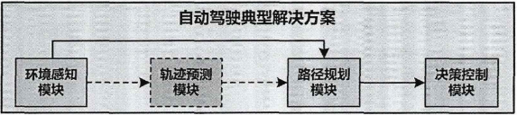

*   狭义上的决策模块只包含行为决策，而广义上的决策模块则包含行为决策、规划甚至是控制模块。

*   目前的决策算法都是从行为决策的角度出发来来进行设计，下游的规划模块根据决策输出来规划可行的动作，但是两个模块解耦并单独进行优化，会导致一些可行解的损失和性能的下降，这些在复杂交通场景下更为突出，常常会导致系统不能求解得到一个可行解而只能执行原有动作或者等待。

*   所以本课题从广义的决策模块设计出发，结合深度强化学习算法，研究复杂场景下车辆决策模块的设计。

*   目前自动驾驶的决策方法主要有基于规则、基于监督学习、基于深度强化学习三类。

    *   基于规则的自动驾驶决策方法

        *   大多数基于规则的自动驾驶决策方法都是基于有限状态机模型（FSM）来实现。

        *   FSM 是一种表示有限个状态以及在这些状态之间的转移和动作等行为的数学模型，具有离散的输入和输出，能很好地与自动驾驶决策任务相结合。

        *   例：

        *   利用有限状态机模型，融合由人类专家根据交通法规和驾驶经验建立的规则，搭建了 Talos 自动驾驶车辆的决策系统

        *   利用有限状态机结合交叉路口安全通行规则，实现了自动驾驶车辆安全通过交叉路口。

        *   针对驾驶场景的多样以及人类驾驶员不同的行为特性，利用有限状态机构建了基于驾驶场景的自动驾驶车辆决策系统，并根据采集的人类驾驶经验数据集，梳理出一套与人类驾驶员决策过程相符合的决策规则，使得自动驾驶车辆有了面对各种驾驶环境与人类驾驶员的能力。

        *   基于规则是一种简单有效的自动驾驶决策方法，并且能适用于各种驾驶环境，具有较强的稳定性与可解释性。

        *   不足

            *   设置一套合理、有效且高水平的决策规则十分困难，常常依赖于专家的经验，而随着场景的逐渐复杂，规则的设计成本也会越来越高，甚至在某些场景下常常只能设置一些保守的规则来保证自动驾驶车辆的安全
            *   随着场景数目不断增加，需要的规则数量也是同步增长，这不仅仅会使得规则库变得十分庞大，同时也会在不同的规则之间产生冲突，使得规则的设计难度进一步增加。
            *   另外，基于规则的决策方法往往只能用于搭建狭义上的决策模块（行为决策模块），而不能解决后续的轨迹规划以及车联控制问题。

    *   基于监督学习的自动驾驶决策方法

        *   基于监督学习的决策方法主要是利用获得的传感器数据与人类驾驶员的驾驶数据作为神经网络的输入与标签进行监督式训练，训练好的网络可以看作是一个由人类驾驶数据产生的规则库，其省去了基于规则的决策方法中繁琐的规则设计过程。

        *   基于监督学习的方法将自动驾驶系统中的感知、决策、规划、控制等模块全部通过一个网络来实现，能内部优化各个模块之间的连接关系并优化整体的性能

        *   不足

            *   只能解决简单的驾驶任务，对于复杂的驾驶环境与驾驶任务，难以胜任；
            *   此外，这种单纯基于人类驾驶数据训练的方法，其性能难以超越人类驾驶水平，且对于一些出现概率较低或者从未出现过的场景，这种方法并不能很好地工作
            *   另一个问题在于这种训练方法不能考虑环境中车辆的交互行为，只能用已有的数据进行训练，当同样的场景下车辆行为不同，则需要新的数据重新训练，对数据的需求量较大。

    *   基于深度强化学习的自动驾驶决策方法

        *   基于深度强化学习的决策方法是自动驾驶决策任务中另一种常用的基于学习的方法，强化学习是利用智能体与环境不断交互产生数据进行训练，这种方法通过奖励信号训练得到一个最优带的策略来执行动作，以获取最大的回报。

        *   相比于基于利用监督学习的方式和人类驾驶员的历史数据训练得到一个策略网络，摆脱了对于人类驾驶数据的依赖，有着超越人类驾驶员驾驶水平的能力

        *   不足

            *   基于深度强化学习算法的自动驾驶决策具有一个较好的性能，但是目前缺乏一个良好的仿真环境来进行交通场景的搭建与算法的训练，一些研究中使用的赛车仿真器，能够训练的场景过于简单，难以迁移到实际交通场景。
            *   此外，目前的算法都没有一个灵活的状态表征方法，例如 Hoel C J 提出的算法固定使用 8 辆周围车辆信息作为网络的输入，当周围不具有 8 辆车时只能进行虚拟车辆的添加，同时也不能处理更多的周围车辆状态。
            *   还有一个问题在于强化学习的基础框架是马尔科夫决策过程，而自动驾驶任务中绝大多数场景都是部分可观测的马尔科夫决策过程，这使得单纯的强化学习算法难以解决实际问题。

    *   目前仍存在着以下不足：

        *   对于基于规则的决策算法来说，其主要问题在于设计困难，对于复杂的交通场景处理能力有限；并且基于规则的算法在更新迭代时，往往需要注意新基于深度强化学习的自动驾驶决策方法研究规则与老规则的冲突问题；并且基于规则的决策模块与其他模块过于独立，难以联合优化。
        *   对于基于监督学习的算法过于依赖人类驾驶数据，对于较少出现以及一些极端的场景不能处理，并且以目前的神经网络能力还不足以完成整个自动驾驶系统的任务。
        *   基于深度强化学习的算法还没有一个成熟的仿真环境来搭建交通场景，同时没有一个灵活的状态表征方法，这使得其应用收到很大的限制。

*   具体工作

    *   仿真平台的搭建

        *   利用 SUMO 仿真软件进行仿真平台的搭建，建立 Python 与仿真平台之间的通信，实现深度强化学习算法基于 SUMO 平台的训练；
        *   基于 SUMO 搭建了三车道无信号灯十字交叉路口场景、双车道无信号灯 T 字交叉路口场景、不规则无信号灯十字交叉路口场景等多个场景，来满足算法的训练与验证的要求。

    *   提出一种新的状态表征方法

        *   利用自注意力机制，搭建自动驾驶车辆对于环境的状态表征模块，该模块可以输入任意数目的自车与他车状态信息，输出的状态信息用于后续的决策输出；
        *   在三车道无信号灯十字交叉路口场景、双车道无信号灯 T 字交叉路口场景仿真场景下，对比验证了新提出的状态表征方法与现有的状态表征方法之间的性能差异。

    *   提出一种新的深度强化学习决策方法

        *   利用长短期记忆网络与注意力机制，实现了一种新的自动驾驶决策方法，解决了在部分可观测环境下的自动驾驶决策问题。具体内容包括：

            *   利用长短期记忆网络搭建了对于他车状态信息预测的网络模块以及利用基于注意力机制的网络搭建了对于他车状态信息预测的网络模块；
            *   将预测网络模块与决策网络模块结合，实现了部分可观测环境下的自动驾驶决策；
            *   在研究 1 搭建的不规则无信号灯十字交叉路口场景与基础算法进行了性能对比与验证。

***

## 研究综述

*   马尔科夫决策过程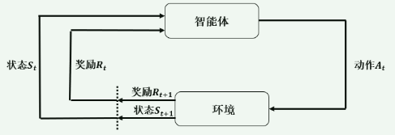

    *   马尔科夫决策过程（MDP）是一种用来解决序列决策问题的建模框架。

    *   在这个框架下，具有两个交互对象，进行学习和决策的对象被称为智能体（Agent），而在智能体以外的与智能体进行交互的其他事物，都被统称为环境.

    *   智能体根据不同的环境状态，选择动作，而环境根据智能体产生的动作进行响应，更新新的环境状态，并将奖励信号返回给智能体。

    *   一个马尔科夫决策过程可以用五个元素组成的元组 $(S,A,P,R,\gamma)$ 来描述

        *   S 表示状态空间，是一个有限的、包含所有环境状态的集合，状态（State）是对环境的描述，在环境和智能体的交互过程中，环境状态会以为智能体的动作而进行演变，且这种演变具有马尔科夫性质

            *   马尔科夫性质：在一个随机过程中，给定当前的状态，未来状态的概率分布只有当前状态有关，与之前的状态无关。

        *   A 表示动作空间，是智能体所有可能执行的动作的集合，动作（Action）可以是离散的，也可以是连续的。

        *   P 表示状态转移概率，状态转移概率是环境的重要描述部分，表征了所有环境状态在所有可能的动作下转移到下一个状态的概率分布，即：𝑆 × 𝐴 → 𝑃(𝐴)，当一个环境确定之后，状态转移概率也随之确定。

        *   R 表示奖励函数，描述了智能体在不同环境状态下执行不同动作获得的奖励

        *   $\gamma$

            表示折扣因子，用来在一个决策序列中计算累计回报，𝛾的大小表示了策略对于未来的重视程度，𝛾越大表示策略更加关注长远的奖励，反之则表示更加关注当前的奖励。

*   部分可观察马尔科夫决策过程

    *   MDP 能够很好地建模序列决策问题，但是难以模拟现实世界中的连续过程，因为现实世界的各种任务一般难以获得对于环境状态的完整观测。

    *   部分可观察马尔科夫决策过程（POMDP）是在马尔科夫决策过程基础上进行扩展的一种框架。在部分可观察马尔科夫决策过程框架下，智能体只能获得对于环境的观测状态，而无法获得完整的环境状态，智能体的策略是从观测状态到动作的映射而不是环境状态到动作的映射。

    *   一个完整的 POMDP 由七个元素组成：$(S,A,P,R,\Omega, O,\gamma)$

        *   式中 $(S,A,P,R,\gamma)$五个元素的定义与 MDP 中相同

        *   $\Omega$

            ​ 表示一组有限的观测集，O 表示在状态 s 和动作 a 的情况下，获得一个观测 o 的概率。

*   强化学习基础与算法分类

    *   MDP 与 POMDP 能够很好地建模一个决策问题，而强化学习（RL）则是一种解决问题的方法。

    *   强化学习不同于监督学习从带有标签的数据中进行学习，也不同于非监督学习在未标注的数据中寻找隐含关系，在强化学习的框架下，智能体只能通过不断地尝试与环境进行交互，来找到合适的动作使得获得的收益最大化，

    *   强化学习包括六个要素：智能体、环境、策略、收益信号、价值函数与对环境的建模。

        *   智能体、环境的定义与 MDP 定义相同

        *   策略描述的是智能体在特定状态下的行为方式，也就是环境状态到动作的映射。策略可能是一个简单的函数或者表格，也可能是一个非常复杂的随机函数，通过神经网络来表示。

            *   强化学习的学习过程就是通过不断地试错与探索，最终学习到一个稳定的、收益最高的策略。

        *   收益信号收益信号是强化学习的目标，在强化学习中，智能体的唯一目标就是最大化长期收益，收益类似于监督学习中的标签，向智能体描述了动作的好坏，智能体通过在与环境的交互过程中获得的收益来改变策略。

        *   价值函数是从某一状态开始，对将来累计的所有收益的期望。

            *   价值函数表示从长远角度来看什么是好的，而收益表示的是短期内的好坏。

        *   对环境的建模并不是强化学习中一个必要的因素，但是一个重要的需要考量的因素。

            *   智能体有了环境的模型，就可以预测在给定状态和动作下环境的下一个状态与收益，此时可以使用规划的方法来求解问题而不是通过不断试错。而同时结合试错与学习环境模型并进行规划的一类方法也是强化学习算法的重要组成部分。

        *   强化学习分类

            *   根据智能体是否使用环境模型来预测当前状态与动作下 下一个状态与奖励分为

                *   基于模型的算法：基于模型的算法需要我们预先知道环境模型或者训练智能体去学习环境模型，当获得环境模型之后，可以使用动态规划等算法来选择最优
                *   无模型算法：在一些复杂任务中，环境模型往往很难构建与学习，而无模型的算法不需要对环境进行建模，可以通过对价值函数进行估计等方式进而学习一个最优策略。无模型的强化学习算法因为摆脱了对环境模型的依赖，因此相比于基于模型的算法适用范围更广泛。

            *   根据智能体策略的学习方式分为

                *   基于值函数的

                    *   基于值函数的算法利用和环境产生的交互数据不断逼近一个真实的状态-动作值函数，并选取每一个状态下值函数最大的动作作为最优动作，并没有直接学习策略。
                    *   基于值函数的算法的主要缺点是一般只能用于低维度的离散动作空间，难以扩展到高维度动作空间以及连续的动作空间下。

                *   基于策略的算法

                    *   基于策略的算法并不去拟合一个值函数，而是直接拟合一个随机策略，策略输出的是在不同状态下选择各个动作的概率。
                    *   基于策略的算法既能在离散动作空间下使用，也能在连续动作空间下使用，具有更加广泛的适用场景，但是具有收敛到局部最优的缺点。

                *   演员-评论家（Actor-Critic）算法

                    *   Actor-Critic 框架用基于策略的方式来训练演员（Actor），Actor 是智能体的策略，用基于值函数的方法来训练一个评论家（Critic）来给策略进行评估。
                    *   这种方式结合了前两者的优势，相比之下会有更好的性能表现。

            *   根据智能体与环境交互的策略与智能体优化的策略是否为同一策略分为

                *   离线策略 off-policy 算法

                    *   利用一个独立的探索策略在环境中进行探索获得经验，并用经验来训练一个不同目标策略。探索策略与环境交互的经验可以存放在一个经验池中，并且不断重复利用，经验数据的利用率大大提升。
                    *   在机器人和自动驾驶等对于数据利用率要求较高的领域，off-policy 算法具有更强的适用性。

                *   在线策略 on-policy 算法

                    *   on-policy 算法探索策略与优化的目标策略是相同的策略，只能利用当前策略或者与当前策略相近的策略获取的经验数据进行训练，而不能利用在之前训练过程中获取的经验
                    *   这也使得 on-policy 算法的经验数据利用率大大降低，往往需要多个环境进行交互采样，对于计算资源要求更高。
                    *   相比于 off-policy 算法，on-policy 算法具有更强的稳定性

***

## 基于 SUMO 平台的仿真环境搭建

*   直接利用实车进行算法的训练方式安全、经济以及时间代价都十分巨大，所以为了利用深度强化学习算法来解决自动驾驶的决策任务，首先需要一个仿真环境来模拟各种实际交通场景，来作为智能体训练的环境。

*   现有方法

    *   目前自动驾驶任务中成熟的强化学习仿真环境大都是基于赛车游戏开发而来，这些环境能够对车辆的控制提供精细的操作，除了基础的加减速以外还能进行离合器和换挡等操作，同时这些环境对于车辆状态的描述也更加详细，甚至能包含发动机工作状态、离合器档位、燃油剩余等车辆状态。
    *   但是对于本文研究的车辆决策问题来说，我们更加关注贴合实际的驾驶场景、更加丰富的车辆交互行为，所以这一类基于赛车游戏开发的自动驾驶仿真平台难以用于对自动驾驶决策算法的研究。
    *   另一种方法是使用成熟的仿真软件来搭建定制化的仿真环境， 这些软件都支持定制所需要的交通场景，能够很好地模拟车辆之间的交互行为，同时还具有丰富的渲染模型来展示逼真的仿真场景。但是丰富的功能也使得这些软件过于庞大，并且冗余的功能对于训练自动驾驶决策算法并没有太大的帮助，反而会减慢仿真的运行速度，而强化学习算法训练对于环境交互的高度依赖，使得我们需要一个更加轻量化的仿真软件来搭建仿真平台。

*   SUMO 是一个免费的开源交通仿真软件，非常轻量化，虽然在可视化上有所差距，但是 SUMO 有丰富的接口，开发者可以利用平台自带的接口获取到想要的信息；同时 SUMO 灵活度非常高，可以自由搭建任何想要的道路结构，并对交通参与者进行个性化的设置；

*   基于 SUMO 平台的仿真环境搭建主要包括三个部分：路网配置、车辆配置以及交通流配置

    *   路网配置

        *   路网配置主要是构建道路的拓扑结构，SUMO 支持从实际的道路地图中提 取对应的道路结构，也支持手动配置需要的道路结构。

        *   SUMO 的路网文件中有三个主要组成部分，分别为节点（Node）、车道（Lane）和边（Edge）。

            *   节点是边的起点与终点，表示了每条边的起始位置与终止位置
            *   边表示了路网的连通关系，在每一条边上有一条或者多条车道，对于每一条边，还可以设置不同的路权以及允许的最大速度。

        *   本文主要使用手动配置的方式，利用 SUMO 搭建了三车道无信号灯十字交叉路口场景、双车道无信号灯 T 字交叉路口场景、不规则无信号灯十字交叉路口场景等多个场景的道路拓扑结构。 

        *   配置好需要的道路拓扑结构后，SUMO 会生成一个.net.xml 文件，这个文 件包含了之前设置好的路网配置信息。

    *   车辆配置

        *   在 SUMO 中，我们可以自由定制想要的车辆类型，支持的基础设置参数有车辆类型，长度、宽度、车辆颜色、最大加速度、最大减速度、最大速度、跟车模型、换道模型等等。

        *   本文中车辆的设置如下：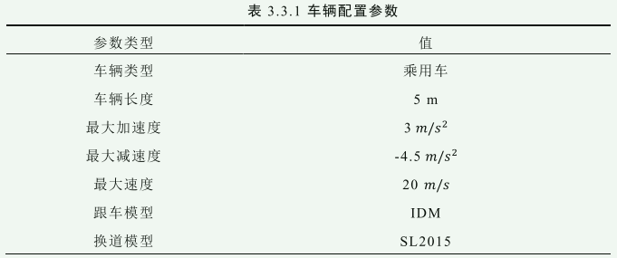

    *   交通流配置

        *   SUMO 中可以通过直接的定义每一条车道交通流密度的方式来配置环境中的交通流，也可以通过指定每一时刻车辆的生成情况来定制生成所需要的交通流本文根据不同的场景与不同的训练需求，选择指定每一时刻车辆的生成情况来定制特定的交通流。
        *   配置好的交通流信息存放在.rou.xml 文件中

    *   将路网、车辆以及交通流文件配置之后，使用一个统一的文件.sumocfg 来读取相应的配置文件，

*   仿真环境总体架构

    *   总体架构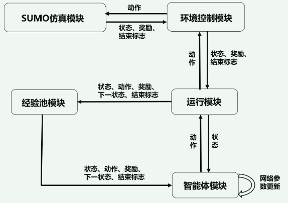

        *   环境控制模块

            *   环境控制模块主要作用是用来控制 SUMO 仿真模块，并与运行模块进行数据交互。

            *   利用一个 env.py 文件对环境进行封装，并留出 `env.reset()`、`env.step()`、`env.close()`等接口与其他文件进行数据交互。

            *   `env.reset()` 的功能是重置环境，启动 SUMO 并返回当前环境状态。其输入参数有两个：

                *   第一个参数为“sumo”或“sumo-gui”，输入“sumo”表示不启用图形界面，能够减少仿真时间，输入“sumo-gui”则启动图形界面，可以看到车辆具体的运行轨迹。
                *   第二个参数是随机种子 seed，seed 会传递给内部的交通流生成函数 ，来控制 SUMO 仿真模块生成不同交通流。

            *   `env.step()` 是环境控制模块与 SUMO 仿真环境交互的重要接口

                *   环境控制模块将运行模块传递的动作，通过 `env.step()`接口输入到 SUMO 仿真环境中，仿真环境中的自车会根据输入的动作获得相应的控制

                *   仿真环境进行下一步仿真并将下一时刻的状态、奖励以及是否结束通过 `env.step()`函数返回到环境控制模块中。

            *   `env.close()`的作用是在一次仿真结束后，关闭当前的 SUMO 仿真，防止在下一次仿真开始时造成冲突，启动失败。

        *   运行模块

            *   运行模块是整个框架的中枢模块，承担了各个模块之间的信息交互作用，运行模块中有三个接口：
            *   运行模块-环境控制模块交互接口：接受环境控制模块中传回的环境状态、奖励以及仿真是否结束等信息，并将动作信息传递到环境控制模块。
            *   运行模块-智能体模块交互接口：主要是将从环境控制模块得到的环境状态转发给智能体模块，并从智能体模块获取生成的动作。
            *   运行模块-经验池模块交互接口：此接口将从环境控制模块获得的状态、奖励、仿真结束信息以及从智能体模块获取的动作信息处理成经验集合{状态、动作、奖励、下一时刻状态、仿真结束信息}，并将处理好的信息发送给经验池模块。

        *   经验池模块

            *   经验池模块有两个主要的功能，第一功能是存储从运行模块中传递的经验，在存储的经验达到设置的最大值时，删除最早的经验并存入最新的经验；第二个功能是从存储的经验中进行批量采样，将采样获得的经验样本传递给智能体模块用于智能体策略网络的更新。

        *   智能体模块

            *   智能体模块是整个架构中最核心的部分，其中的接口有：动作选择接口、随机动作选择接口、神经网络训练接口、模型存储接口、模型加载接口。

                *   动作选择接口输入当前的环境状态，并输出一个动作，该动作是一个定值或者确定的概率分布，其主要用于智能体训练完成之后的测试阶段。
                *   随机动作选择接口与动作选择接口一样，都是输入环境状态输出动作，但是与动作选择接口不一样的是，随机动作选择接口有一定的随机概率输出一个随机选择的动作，该接口主要用于智能体训练阶段，通过随机的动作去进行环境探索，扩大策略搜索范围，避免陷入局部最优策略。
                *   神经网络训练接口用于接受经验池模块的采样数据并利用数据进行网络训练。
                *   模型存储接口与加载接口用于在训练时存储不同阶段的神经网络模型，在测试阶段加载神经网络模型。

    *   数据传递

        *   状态-动作数据传递：用于在训练过程中环境与智能体之间的交互以及在测试过程中对算法性能的测试。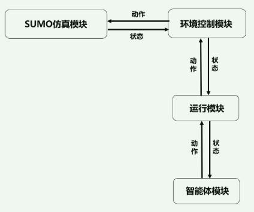

            *   状态信息从 SUMO 仿真模块发出，经由环境控制模块、运行模块传递到智能体模块、智能体模块根据获得的环境状态信息作出决策动作
            *   并经由运行模块与环境控制模块发送回 SUMO 仿真模块，SUMO 仿真模块根据动作执行对应指令，进行仿真得到下一时刻环境状态。

        *   经验数据传递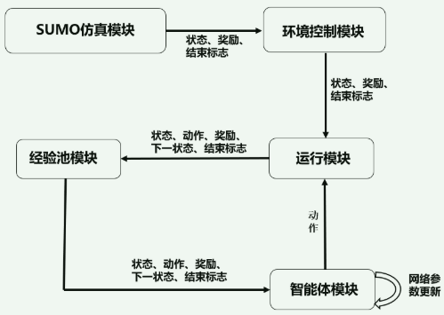

            *   状态、奖励、结束标志信息从 SUMO 仿真模块发出经由环境控制模块到达运行模块
            *   动作数据从智能体模块发送到达运行模块，运行模块将两种数据处理得到经验集合{状态、动作、奖励、下一时刻状态、仿真结束信息}，并将其发送到经验池模块进行存储，
            *   在智能体与环境进行交互的探索过程中，经验池模块也会将采样的经验样本发送到智能体模块，智能体模块利用得到的经验样本进行训练以提升策略网络的性能。

***

## 基于注意力机制的强化学习状态表征方法研究

*   状态表征问题的提出

    *   状态空间的设计是构建一个 MDP 问题的首要步骤，状态信息是智能体策略的输入，对策略的收敛结果、收敛速度、性能有着重要影响。

    *   自动驾驶任务状态表征的难点：

        *   首先需要针对不同的驾驶场景划分一个合理的观测范围，因为自动驾驶车辆的传感器硬件限制，车辆的感知范围是有限，同时过大的观测范围会引入不必要的信息冗余，使得策略难以收敛到最优。而过小的观测范围则可能不足以获得足够的观测信息，难以学习到合理的策略。
        *   同时自动驾驶场景中的元素组成更加复杂，其不仅包括智能体控制的自车，还包括环境中参与交通的其他车辆，以及参与交通的非机动车辆与行人。而且随着交通场景的变化，还需要考虑车道信息、交通信号灯信息等道路信息。除了有着复杂的组成元素以外，
        *   自动驾驶场景种元素集合的动态变化特性。例如在不同的时间，位于自车周围的他车集合是不同的，会不断有他车驶出自车的观测范围，从而在集合中被删除，也会有他车驶入自车的观测范围而加入集合，这也使得集合的大小一直处于动态变化的状态，难以使用一个固定的方式去描述他车集合。对于行人和非机动车集合也存在同样的问题。

*   现有状态表征方法

    *   目前的深度强化学习算法，都是基于神经网络对于策略函数或者值函数进行拟合，神经网络的输入维度在初始化时就已经固定了，对于动态变化的输入，网络并不能处理，这就意味着不能直接使用这种动态变化的元素集合作为状态输入来训练网络。

    *   针对这一问题，目前自动驾驶场景下的强化学习算法的状态表征方法主要有：基于固定长度列表的状态表征方法、基于表格的状态表征方法、基于图像的状态表征方法

        *   为了表达的简洁与方便，本小节只对动态变化的他车集合状态表征这一问题进行阐述，而动态变化的非机动车集合以及行人集合，本小节介绍的方法同样适用。而为了降低问题的复杂程度，没有将车道信息、信号灯信息等元素加入状态空间。

        *   基于固定长度列表的状态表征方法

            *   将选取车辆的物理状态特征作为每一辆车的车辆状态 $s_i$，$s_0$ 表示自车的车辆状态，$s_1$ 至 $s_N$​表示自车观测范围内 N 辆他车的车辆状态；并将所有车辆状态向量拼接成一个特征向量作为自车的观测向量 S$s_{i}=[x_{i},y_{i},v_{i},a_{i},\theta_{i}]\quad i\in[0,N]\\S=[s_{0},s_{1},\ldots\ldots s_{N}]$

                *   可以选取车辆的横向位置 x、纵向位置 y、速度 v、加速度 a、航向角 𝜃 来表征每一辆车的车辆状态

            *   N 随着时间在不断变化，𝑺 的维度也在不断变化，所以并不能直接将 S 输入神经网络，需要对 S 进一步处理使其变为一个固定维度的向量。

            *   假定环境中可能观测到的最大他车数量为 M，当实际观测数量 N 少于 M时，在环境中添加虚拟他车，这些虚拟车辆的车辆状态 $s_{j}^{\prime}=[0,0,0,0,0](j\in[N+1,M])$，并将这虚拟他车的车辆状态也与自车的观测向量 S 进行拼接得到一个最终的观测状态 O：$O=[s_{0},s_{1},......s_{N},s_{N+1}^{\prime},......,s_{M}^{\prime}]$

            *   基于固定长度特征向量的状态表征方法的表达方式简洁清晰，同时通过人工选取的特征，能够对环境状态进行表达。

            *   缺点

                *   为了维持状态维度的不变，引入了虚拟车辆的存在，为了保证实际车辆不超过设定的最大车辆数目，往往需要将 M 设为一个较大的值，这也增大了神经网络的输入维度；

                *   同时虚拟车辆的特征并没有实际的含义，会使得状态信息冗余进而影响训练过程中策略的收敛速度与最终的收敛性能。

                *   另一个重要问题是这种基于固定长度向量的方式，并不具有置换不变性。

                    *   在观测状态 O 中，环境中各个车辆的状态的排列顺序是没有一定规则的，在相同的环境下， 排列可能为 $O=[s_{0},s_{1},......s_{N},s_{N+1}^{\prime},......,s_{M}^{\prime}]$，也可能为$O=[s_{0},s_{N},......s_{1},s_{N+1}^{\prime},......,s_{M}^{\prime}]$。

                    *   相同的环境有着多种观测状态 O，并且由于神经网络各个节点之间的参数为一一对应的关系，这也意味着不同的观测状态 O 输入到网络中，会获得不同的输出结果，这不仅会对训练的过程产生影响，还会影响训练得到的策略的可行性。

        *   基于表格的状态表征方法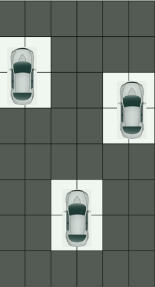

            *   该方法将自动驾驶车辆的感知区域转换为一个鸟瞰视角的栅格地图，自动驾驶车辆与周围的其他车辆根据实际位置占据地图中的栅格

            *   使用 $s_i$来表示自车与他车的车辆状态信息，栅格地图自带位置信息，用一个和栅格地图相同维度的矩阵来表征当前的观测状态 O，当栅格地图中的网格被车辆占据时，将对应的车辆状态填入观测状态矩阵 O 中$\boldsymbol{O}=\begin{bmatrix}s_1&\boldsymbol{0}&\boldsymbol{0}\\\boldsymbol{0}&\boldsymbol{0}&\boldsymbol{s}_2\\\boldsymbol{0}&\boldsymbol{s}_0&\boldsymbol{0}\\\boldsymbol{s}_3&\boldsymbol{0}&\boldsymbol{0}\end{bmatrix}$

            *   固定观测范围、矩阵位置与实际位置相关排列

            *   缺点

                *   状态的维度太大，相比于基于固定长度特征向量的状态表征方法，需要在没有车辆占据的栅格中填充更多的虚拟车辆；
                *   栅格的大小难以设计。过大的栅格尺寸可能出现两辆车同时占据一个栅格的情况，不仅会导致网格中特征的冲突，还会损失掉车辆准确的位置信息；而过小的栅格尺寸会大大增加状态矩阵的大小，使得神经网络的模型变大，训练变得更加困难。

        *   基于图像的状态表征方法

            *   直接将图像信息作为状态信息输入到卷积神经网络中，并将卷积得到的特征输入到深度神经网络输出一个值函数或者一个动作的概率分布。

            *   直接使用视觉传感器的输出作为网络的输入，不需要做额外的设计与处理，这使得其相比于基于固定长度特征向量以及基于栅格地图的方法更加方便；

            *   同时使用图像作为输入，不需要考虑周围他车集合的动态变化以及置换的不变性。

            *   缺点：

                *   像中包含的信息过于冗余，许多与决策不相关的特征如：路边的树木、建筑、其他车辆的颜色等等都将作为状态输入到网络中，在这些冗余的、不相关的信息干扰中找到与决策相关的特征并学习到一个可行的策略是非常困难的。
                *   另一个问题在于为了更好地表征出自车与周围他车的关系，一个鸟瞰视角的图像是较为合适的，然而在实际的自动驾驶任务中，自动驾驶车辆难以实时获得鸟瞰视角的图像。

*   基于自注意力机制的状态表征方法

    *   为了保证状态空间的置换不变性以及减少状态空间中不必要的信息冗余，本节提出一种基于自注意力机制的状态编码方法。

    *   计算步骤

        *   选取车辆的物理状态特征作为每一辆车的车辆初始状态 $s_i$，$s_i$经过一层全连接编码网络得到编码之后的向量$a_i$，编码之后的向量$a_i$分别经过三个全连接网络得到三个不同的向量，分别为查询向量$q_i$、键向量$k_i$、值向量$v_i$$\alpha_{i}=W^{\alpha}s_{i},\;q_{i}=W^{q}\alpha_{i},\;k_{i}=W^{k}\alpha_{i},\;v_{i} =W^{v}\alpha_{i}$

        *   使用缩放点积计算每一个 q 与 k 之间的相关系数 $\alpha_{i,j}=\frac{q_{i}\cdot k_{j}}{\sqrt{d}}$​

            *   d 为 q 与 k 的维度。除以 $\sqrt{d}$是为了降低 q 与 k 点积的方差，防止后面不同的键向量与同一个查询向量之间的相关系数相差很大

        *   使用 Softmax 函数对同一个查询向量 q 与不同键向量 k 之间的相关系数进行对齐：$\hat{\alpha}_{i,j}=\frac{\exp{(\alpha_{i,j})}}{\sum_{k}\exp{(\alpha_{i,k})}}$​

            *   为了状态编码模块能够解决他车集合动态变化问题，添加虚拟车辆保证输入到状态编码模块中的车辆状态序列 O 长度保持为固定值 M。

            *   同时为了去除所添加的虚拟车辆引入的信息冗余问题，使用填充掩码机制，在第三步用 Softmax 函数进行对齐之前，首先使用掩码向量P对系数 $a_{i,j}$进行处理，将所有车辆与填充的虚拟车辆的相关系数置为负无穷大，再经过Softmax 函数处理之后，虚拟车辆所占的权重系数为 0，

        *   利用对齐之后的相关系数 $\hat{\alpha}_{i,j}$与值向量 𝒗 进行加权求和，得到一个经过自注意力机制处理之后的、融合了所有车辆信息的车辆状态向量$s_{i}^{\prime}=\sum_{j}\hat{\alpha}_{i,j}v_{j}$​

        *   为了提高网络的表征能力，将 $s_i^{'}$输入到一个前馈神经网络中，使用 Relu 作为激活函数，输出的向量记为$o_i$。

    *   基于以上自注意力机制的状态表征，提出两种状态表征方法：关注自车状态的表征方法与融合周车状态的表征方法

        *   关注自车状态的表征方法（state-ego）只利用编码模块输出的 $s_0^{'}$作为后续的策略网络的输入，由于经过了自注意力机制的处理$s_0^{'}$不再只包含自车的车辆状态信息，而是自车状态信息与他车状态信息在不同权重系数下的累加

        *   融合周车状态的表征方法（state-around）是在关注自身状态的表征方法基础上，将自车的编码状态周围其他车辆的编码状态进行累加，得到的向量作为自车的观测状态$O_{state\_ around}$

    *   基于自注意力状态表征的强化学习算法

        *   深度 Q 网络算法（DQN）首次将强化学习算法与深度神经网络进行结合，是深度强化学习的开山之作，DQN 算法是在 Q-learning 算法的基础上发展而来，是一种 off-policy 算法，能够使用经验回放的方式对历史数据重复利用，是一种数据利用率高的算法，适合自动驾驶任务场景。

        *   基于自注意力机制的状态表征模块能够灵活地与各种深度强化学习算法的网络结合，本节以经典的 DQN 算法为例，提出两种结合不同状态表征模块的改进算法，其中一种算法 SE-DQN 以$O_{state\_ ego}$作为观测状态，另一种算法 SA-DQN以$O_{state\_ around}$​作为观测状态，两种算法的网络结构完全一样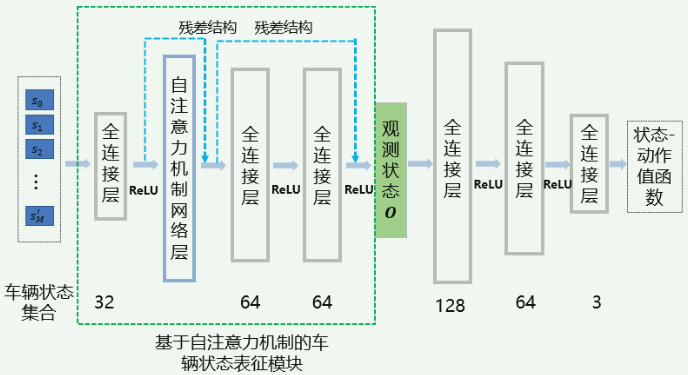

        *   实验设计

            *   算法输入输出

                *   选取观测范围内车辆的横向位置 x、纵向位置y、速度 v、加速度 a、航向角 $\theta$作为每一辆车的基础车辆状态。

                *   本研究选取{加速，保持，减速}三个动作作为算法的输出，其中加速时/加速度为 $3m/s^2$，减速时加速度为$-3m/s^2$。只对车辆的加速度进行控制，而不对车辆的方向盘转角进行控制，车辆按照一条固定的路径通过路口，横向控制由 SUMO 底层控制程序完成。

            *   奖励函数设计

                *   针对无信号灯路口的交通场景，本研究从安全、效率（通过时间）、完成任务目标等角度出发，设置奖励函数$R=r_{acc}+r_{arrival}+r_{collision}+r_{step}$

                    *   $r_{acc}$

                        从效率的角度出发进行设置，与自车的加速度正相关，自车加速度越大，获得的奖励也越高，反正自车减速会获得对应的惩罚，该项主要是为了得到一个尽可能快速通过路口的策略：$r_{acc} = 自车加速度$

                    *   $r_{arrival}$

                        表示的是车辆到达目的地的奖励，在仿真中，我们将自车的目的地设置在通过路口之后的位置，当车辆到达此位置时将获得+50 的奖励，否则该奖励为 0。

                    *   $𝑟_{collision}$

                        表示车辆碰撞的奖励，当自车与周围车辆发生碰撞时，自车会获得-100的惩罚，该项的作用是防止碰撞，避免自车为了更高的奖励而忽略了与他车的碰撞风险。

                    *   $r_{step}$

                        表示每一个时间步添加的一个较为微小的惩罚，主要作用是避免车辆学习到一直原地停止的策略，当车辆原地停止时，如果只考虑前三个奖励，那么此时𝑅为 0，在实际训练过程中，自车往往会为了避免碰撞的惩罚而学习到一个一直停车的局部最优策略。$r_{step}=-0.1$​

            *   动作随机概率设置

                *   本研究使用动作随机概率逐渐衰减的方式，来使得算法在不同的阶段具有不同的策略探索能力，这种探索方式能够增大在训练前期探索到最优策略的概率，同时又保证了在后期策略的稳定性，不会因为过多的随机动作导致失败。$\varepsilon_{t}=\begin{cases}\alpha\varepsilon_{t-1},&\quad if \alpha\varepsilon_{t-1}>\varepsilon_{min}\\\varepsilon_{min},&\quad else\end{cases}$

        *   实验分析

            *   三车道无信号灯十字交叉路口场景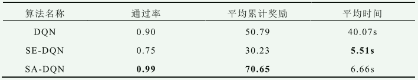

                *   收敛速度上，SE-DQN 优于 DQN 算法与 SA-DQN 算法
                *   SA-DQN 具有最高的通过率 0.99，且远高于 DQN 算法 0.90 的通过率以及 SE-DQN0.75 的通过率，同时 SA-DQN 算法的平均累计奖励也是最高的，达到了 70.65。
                *   SE-DQN 算法在不同场景下动作曲线趋势完全相同，这说明 SE-DQN 算法学习到的策略是一个过拟合的策略，面对不同的输入状态执行了完全相同的动作，导致其碰撞率高，导致仿真提前结束，所以平均时间低于 SA-DQN 算法。
                *   同时 DQN 算法 40.07s 的平均时间明显高于其他两个算法，原因是 DQN 算法在某几个测试场景下，一直仿真到最大仿真步数才结束仿真，这是因为车辆一直制动停留在原地所导致的。

            *   双车道无信号灯 T 字交叉路口场景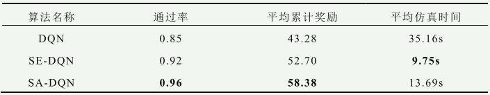

                *   在双车道无信号灯 T 字交叉路口测试中，SE-DQN 算法与 SA-DQN 算法的通过率相比于 DQN 算法更高，平均奖励更大，其中 SA-DQN 算法的性能更优于 SE-DQN 算法。
                *   各个算法的表现与三车道无信号灯十字路口场景大致相同，SA-DQN 算法收敛到一个较为优秀的策略，DQN 算法的最终策略较为保守，而 SE-DQN 算法则依然过拟合到一个激进的策略。

***

## 融合他车状态预测的自动驾驶决策方法研究

*   目前较为常用的自动驾驶决策规划框架，都是基于预测模块输出的他车预测轨迹，然后使用经典的路径规划算法进行路径规划，这种方式的主要问题是预测轨迹会将许多可通行区域变为不可通行，减少了可行解的空间，在复杂环境下可能出现找不到可行解。

*   使用强化学习算法来进行自动驾驶车辆的决策与规划，为了解决环境部分可观的问题，需要从预测模块输出的预测轨迹中提取状态来作为他车不可观测的隐状态，把问题转换到 MDP 框架下进行求解。这种方式使得强化学习算法的输入维度变得十分巨大。

*   由于使用强化学习算法进行决策与规划，并不需要像使用经典的路径规划算法一样依赖于他车精确的预测轨迹，本研究提出一种融合预测模块的自动驾驶决策框架。 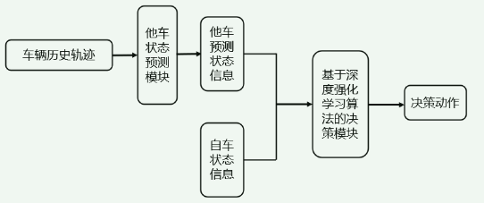

*   预测模块设计

    *   基于 LSTM 网络的预测模块设计

        *   很多研究基于 LSTM 网络开发出各种轨迹预测算法，这些算法大都是基于编码器-解码器架构搭建网络，编码器与解码器都由 LSTM 网络组成，编码器输入具有时序信息的车辆历史轨迹数据，提取出相应的特征，再使用解码器对特征进行解码获得预测轨迹。对于基于深度强化学习算法的决策规划方法，需要再使用神经网络从解码器的输出中去提取特征作为他车的隐状态表征，而直接使用编码器输出的特征是一个更加简单直接的方式。

        *   本研究使用 LSTM 网络搭建一个他车状态预测模块，输入是当前时刻他车状态以及前 T 个时间步的他车历史状态信息集合，使用 LSTM 网络的输出作为他车的预测状态 $\tilde{S}$​​。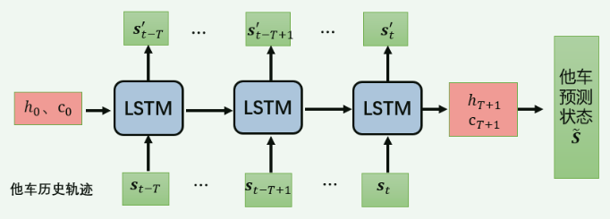

    *   基于自注意力机制的预测模块设计

        *   LSTM 网络虽然能有效处理时序信息，但是其依次处理输入序列的方式使得其运行速度较慢，同时复杂的门结构也使得网络复杂，参数过多。

        *   注意力机制相比 LSTM 网络的一大优势在于结构简单，在注意力机制框架下，只需要通过全连接网络以及加权求和的方式，就能获取整个序列中的重要信息，且不会存在历史信息衰减的问题，另外注意力机制并不依赖上一时刻网络的输出作为隐状态输入，而是直接使用其他时刻的输入来计算，所以每一个时间步的输入信息都可以并行计算得到输出结果，相比于 LSTM 的串行处理速度更快。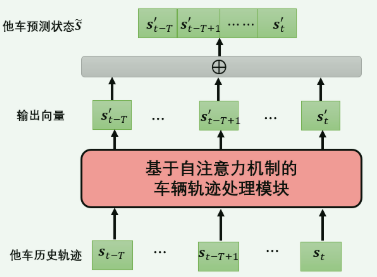

    *   他车预测状态后处理模块

        *   由于周围他车集合的动态变化，使用第 4 章提出的基于自注意力机制的状态编码模块对他车的预测状态进行状态编码。

        *   状态编码模块的输入是通过预测模块获得的他车预测状态集合 ${\tilde{S}_1, \tilde{S}_2,⋯⋯, \tilde{S}_𝑁}$，以及为了保持输入编码模块的序列长度固定的虚拟车辆预测状态${\tilde{S}_{𝑁+1}, \tilde{S}_{N+2},⋯⋯, \tilde{S}_M}$​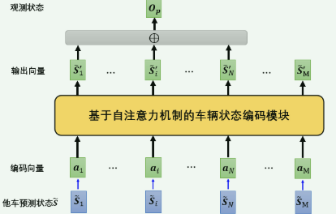|

*   融合他车状态预测的强化学习算法

    *   融合 LSTM 网络的强化学习算法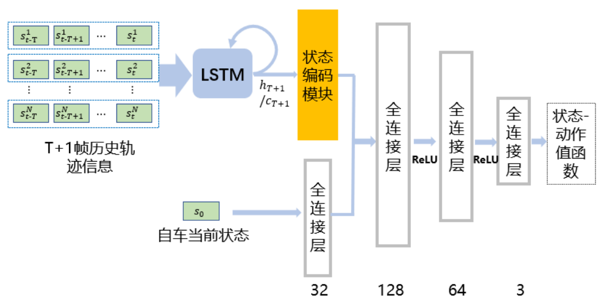

        *   进一步将融合 LSTM 网络的 DQN 算法分为两种：一种是使用最后一个时刻 LSTM 网络输出的细胞状态𝑪作为车辆隐状态，称其为 LC-DQN 算法；一种是使用最后一个时刻 LSTM 网络输出的隐状态ℎ𝑡作为车辆隐状态，称其为 LH-DQN 算法。融合自注意力机制网络的 DQN 算法称其为 A-DQN 算法。

    *   融合注意力机制网络的强化学习算法 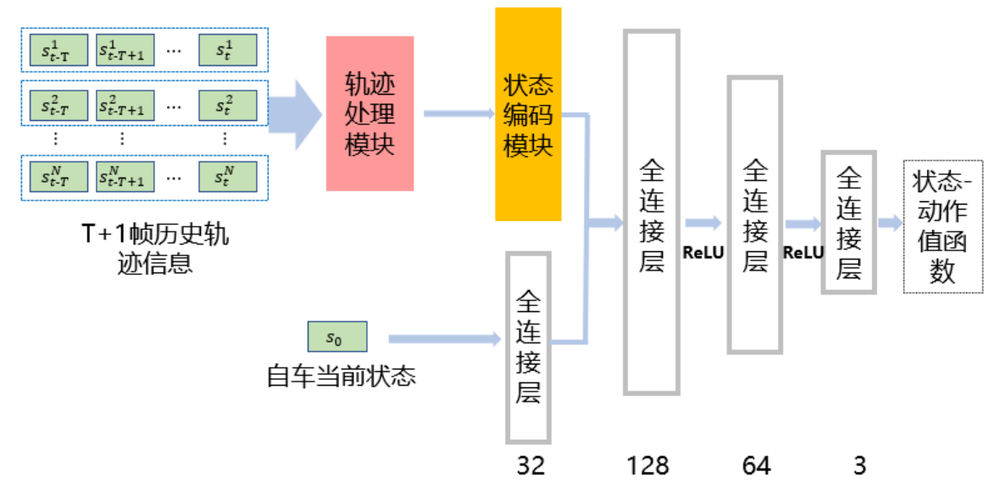

*   实验分析

    *   实验设置与第4章一致

    *   算法性能对比 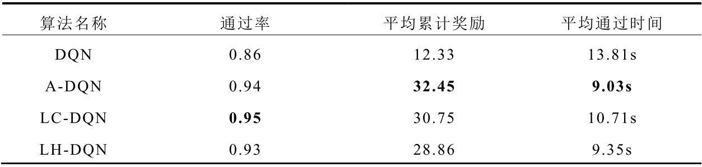 

        *   在通过率方面，A-DQN、LC-DQN、LH-DQN 三个算法性能相差不大，分别为 0.94、0.95、0.93，而对比算法 DQN 的通过率为 0.86，低于本文提出的三个算法。
        *   本章提出的 LC-DQN算法、LH-DQN 算法以及 A-DQN 算法获得的平均奖励远高于对比的 DQN 算法
        *   从收敛速度来看，LC-DQN 算法、LH-DQN 算法、A-DQN 算法的收敛速度明显快与 DQN 算法，三种算法中 A-DQN 算法具有更快的收敛速度以及更高的稳定性

    *   消融实验 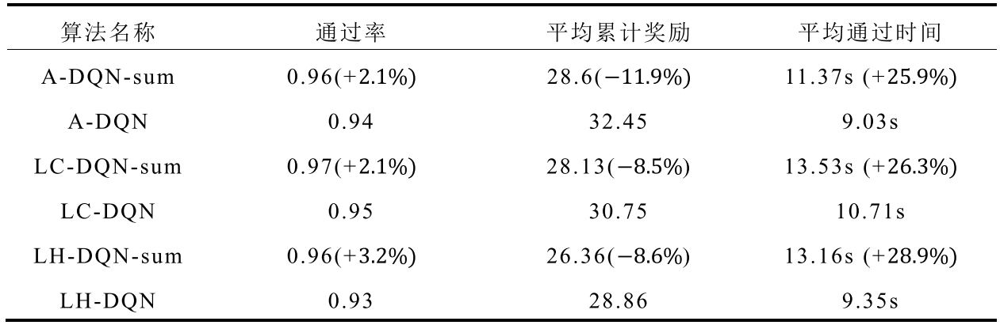

        *   进行消融实验，对比去掉他车预测状态后处理模块之后的算法 A-DQN-sum、LC-DQN-sum、LH-DQN-sum 与完整算法 A-DQN、LC-DQN、LH-DQN 的性能。
        *   与原始算法相比，去掉了他车预测状态后处理模块的三个算法除了通过率上性能略有所提升外，在平均累计奖励对比中，三个算法相比于原始算法都出现了性能下降。
        *   而对比平均时间可以发现，三种算法相较于原始算法均出现了通过时间增长的情况

***

## 研究展望

*   本研究提出的算法只通过对加速度的决策进行了车辆的纵向控制，固定了车辆的行驶路径，这种方式虽然不影响算法的实际使用，但是也损失了一部分可行解。后续的研究可以考虑在动作空间加入车辆的横向控制动作，进而得到一个更优的决策算法。
*   本研究搭建的仿真场景中的他车控制模型依赖于 SUMO 软件的底层控制，受限于计算时间与算法水平，他车的驾驶模型过于简单，在验证融合他车状态预测的决策算法过程中，只能通过给他车设定不同的目的地来使得他车产生一些意图的随机性，在后续研究中可以继续扩展基于 SUMO 搭建的仿真平台，通过替换环境中他车的控制模型来使得场景更加真实。

## DQN

*   摘要

    *   提出第一个使用强化学习直接从高维感知输入中成功学习控制策略的深度学习模型
    *   使用卷积神经网络接收原始图像作为输入，用Q-learning的变体进行训练，输出估计未来奖励的值函数。

*   研究背景

    *   直接从视觉和语音等高维感官输入中学习控制智能体是强化学习的长期挑战之一。在这些领域上运行的大多数成功的RL应用程序都依赖于手工制作的功能与线性值函数或策略表示的结合，这种系统的性能在很大程度上依赖于特征表示的质量。
