# 面向自动驾驶场景的图像语义分割算法研究

\[TOC]

## 论文摘要

*   题目：面向自动驾驶场景的图像语义分割算法研究
*   摘要：针对自动驾驶语义分割技术中的准确率和实时性要求进行研究与实验，分别提出了高准确率图像语义分割方案和实时图像语义分割方案，提升了自动驾驶语义分割技术的总体性能。并且设计了一个驾驶场景语义分割系统，为自动驾驶的语义分割问题提供了一个可视化的分析平台。
*   关键词：自动驾驶，图像语义分割，注意力机制，特征融合

## 研究背景目的

*   语义分割

    *   **图像语义分割是指将图像中的每个像素分配到对应的类别，从而实现对图像中不同物体的识别和分割。**
    *   与传统的图像分类或目标检测不同，语义分割可以提供更精细的图像分割结果，使车辆能够更好地理解周围环境，并做出更明智的驾驶决策。
    *   为车辆提供有效的环境感知信息，如障碍物、可行驶区域、交通标志等。

*   自动驾驶场景下的图像语义分割面临着准确率和实时性两大挑战

    *   一方面，道路交通环境复杂多样，目标差异较大，视觉传感器易受光照条件干扰，在恶劣条件下成像质量低；
    *   另一方面，车辆行驶速度较快，环境感知信息巨大，图像分割速度难以达到实时性要求。

*   背景知识

    *   自动驾驶分级

        *   L1（驾驶辅助）：

            *   描述：车辆可以在一定条件下提供单一的驾驶辅助功能，如自动刹车或加速。
            *   示例系统：ACC（自适应巡航控制）。驾驶员仍需控制方向盘。

        *   L2（部分自动化）：

            *   描述：车辆可以同时控制方向盘和加速/刹车，但驾驶员必须随时保持注意并准备接管控制。
            *   示例系统：ACC + LCC（车道居中控制）。这些系统结合起来，使车辆能够在高速公路上保持车道和速度。

        *   L3（有条件自动化）：目前已发售车型达到最高等级

            *   描述：车辆在特定条件下能够完成所有驾驶任务，但驾驶员必须在系统请求时接管控制。
            *   示例系统：NOA（自动导航驾驶），在高速公路上自动变道、匝道进出、超车等，但在复杂情况下需要驾驶员干预。

*   具体工作

    *   改进了一种高准确率图像语义分割方案

        *   利用 HRNet（High-Resolution Net）保持高分辨率特征

        *   引入 OCRNet 增强对象级别的语义信息。

        *   并对以上方法进行了三点改进

            *   改进了上采样模块，根据网络模型通道间的重要性分配不同的权重，使上采样过程更有针对性；
            *   优化了网络结构，增加了浅层和深层特征之间的连接；
            *   改进了 HRNet 的卷积模块，使用残差 ASPP 代替普通卷积来增强多尺度感知能力。

        *   在 Cityscapes 数据集和 Camvid 数据集上的平均交并比 mIoU 分别为 81.20%和 72.06%。

    *   改进了一种实时图像语义分割方案

        *   该方案以知识蒸馏和特征融合为基准，主要进行了以下四点工作：

            *   利用一个参数量多的大模型（教师网络）监督轻量化的小模型（学生网络）训练，使学生网络能够从教师网络中学习到有效的语义信息；
            *   改进了灵活解码器模块，使其网络通道数量与输入图像大小对应，避免计算冗余；
            *   改进了基于注意力机制的特征融合模块，优化特征交互与融合；
            *   优化了金字塔池化模块的结构，减少计算量和内存消耗。

        *   可以有效提升语义分割算法在 Cityscapes 数据集上的分割速度，提升了语义分割技术的实用性和应用范围。

    *   设计了一个面向驾驶场景的语义分割系统

        *   该系统基于语义分割技术实现对车辆场景中各种目标的像素级分类，提供了一个可视化界面来展示分割结果，
        *   并且还可以作为一个通用的研究平台，支持不同的语义分割算法进行对比和评估。
        *   系统包含数据采集层、数据存储层、业务层和展示层，4 个层次。
        *   能够对驾驶场景的图像进行像素级的语义标注，支持多种语义分割模型的切换和性能比较，并且还能够对分割结果进行可视化展示。

***

## 研究综述

*   问题定义

    *   从标签空间 $L=\{l_1,l_2,l_3,\cdots,l_n\}$中表示一组随机变量$R=\{R_1,R_2,R_3,\cdots,R_n\}$。L 代表类别标签的集合，l 代表不同的类别对象，R 表示待分割的图像的像素点，n 是该图像中像素点的总个数。

    *   语义分割中的集合定义如下：给定集合 R 表示一张图像上的全部像素点，那么语义分割任务就是将集合 R 中的元素，按照它们各自的语义信息，划分到符合以下条件的子集 $R_i$ 中：

        *   $U_{i=1}^{ N}R_{i}=R$

            ；

        *   对于所有的 i 和 j, 若 $i\neq j$，有$R_{i}\cap R_{j}\neq\varnothing$；

        *   对于 $i=1,2,\cdots,N$ ，有 $P(R_{i})=True$​；

            *   $P(R_i)$

                表示子集 R 中所有像素点是否属于同一个语义类别

        *   对于 $i\neq j$，有$P(R_{i}\cup R_{i})=False$；

        *   对于 $i=1,2,\cdots,N$ , $R_i$​是原图像中连通的区域。

            *   对于图中框出的两辆车，他们的语义类别应当一致，但是分开的两块连通区域

*   评估指标

    *   准确率指标

        *   平均交并比（mIoU）

            *   交并比表示两个集合的交集与并集的比值

            *   对数据集中的所有语义类别计算 IoU 后取平均值得到平均交并比$mIoU=\frac{1}{k+1}\sum_{i=0}^{k}\frac{p_{ii}}{\sum_{j=0}^{k}p_{ij}+\sum_{j=0}^{k}p_{ji}-p_{ii}}$

                *   $p_{ii}$

                    表示分类正确的像素数量， $p_{ij}$​表示属于 i 类但被预测为 j 类的像素数量，在数据集中共有 k+1 个类别(包含背景)

        *   像素准确率（Pixel Accuracy，PA）

            *   表示分类正确的像素点的数量占图像中全部像素点数量的比值$PA=\frac{\sum_{i=0}^kp_{ii}}{\sum_{i=0}^k\sum_{j=0}^kp_{ij}}$​

        *   平均像素准确率（Mean Pixel Accuracy，mPA）

            *   先计算每个类别标签中正确分类的像素点个数与该类别标签中全部像素点个数的比值，然后计算图像中全部类别的平均值。$mPA=\frac{1}{k+1}\sum_{i=0}^k\frac{p_{ii}}{\sum_{j=0}^kp_{ij}}$

    *   实时性指标

        *   在语义分割领域，能够突出实时性的指标主要有三种，分别是模型参数量、浮点计数量和帧率。

        *   模型参数量(params)

            *   模型参数量可以衡量一个模型的大小及其复杂程度，直接决定了模型在实际应用中部署的难易程度。模型的参数量只和网络结构有关，当网络结构确定后，参数量同样确定。

            *   卷积层参数量计算：$Params_{conv}=(K_{h}\times K_{w}\times C_{in})\times C_{out}+C_{out}$​

                *   $C_{in}$

                    和 $C_{out}$分别表示输入的通道数量和输出的通道数量，$K_{h}$和$K_{h}$分别表示卷积核的高和宽

            *   全连接层参数计算：$Params_{fcn}=N_{in}\times N_{out}+N_{out}$

                *   $N_{in}$

                    和 $N_{out}$​分别表示输入和输出的节点数量。

        *   浮点计算量（FLOPs）

            *   FLOPs 指模型或算法判断推理时需要计算的次数，可以衡量算法或模型的计算量和复杂程度，不同于模型参数量，FLOPs 与特征图的大小也有关系。

            *   对于卷积层来说，因为特征图上每个点的权值是共享的，FLOPs 需要在模型参数量的基础上乘上特征图的大小。$FLOPs_{conv}=Params_{conv} \times (H \times W)$

            *   全连接层没有权值共享，其计算法方法和模型参数量保持一致。$FLOPs_{fcn}=Params_{fcn}=N_{in}\times N_{out}+N_{out}$​

        *   帧率（FPS）

            *   FPS 指每秒传输的帧数，用来测量动态视频的信息数量。在图像分割中，FPS 用来表示每秒分割的图像数量。

*   主流语义分割数据集

    *   Cityscapes 数据集

        *   Cityscapes 是当前主流的、常用的、比较权威的可以用来评估城市交通场景视觉算法的大型数据集，是最具有代表性的语义分割数据集之一，也是自动驾驶感知领域内认可度较高的数据集。
        *   该数据集收集了 50 个国外不同城市在不同季节的城市街道交通图像，并且从 30 类交通场景物体中选择了 19 个比较常见的类别进行精细的像素标注，每一张图片的像素分辨率都为 2048×1024。

    *   CamVid 数据集

        *   CamVid 数据集在 2009 年发布，通过摄像头以自动驾驶视角拍摄了汽车行进过程中的交通场景视频，提供了超过 10 分钟的频率为 30Hz 的高质量连续镜头，标注了 701 张分辨率为 960×720 的图像，该数据集将视频中的每一帧的像素点和一个语义类别标签对应起来。
        *   CamVid 虽然提供了 32 个语义标签，但是通常对 11 个常用的类别进行分割准确率的评估，分别为：道路、交通标志、汽车、天空、行人道、电线杆、围墙、行人、建筑物、自行车、树木

*   空洞卷积

    *   语义分割是一个像素级的预测问题，图片进入到神经网络后进行卷积及池化一系列操作，降低特征图的尺寸同时也可以增加感受野，但是会导致一个严重的问题发生：图像的细节信息大量丢失，小物体信息不能够重建。

    *   空洞卷积（Dilated Convolution）是针对上述问题而提出的一种新的卷积思路 

    *   空洞卷积在卷积核中引入扩张率（Dilation Rate）这一参数使得尺寸大小相同的卷积核能够获得更大的感受野。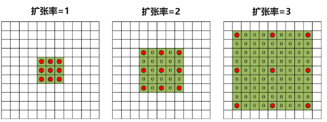

        *   扩大感受野：

            *   空洞卷积在不增加参数量的情况下显著扩大了卷积核的感受野。例如，扩张率为 2 的 3x3 卷积核的感受野相当于 5x5 的标准卷积核，而扩张率为 4 的 3x3 卷积核的感受野相当于 9x9 的标准卷积核。

        *   保留分辨率：

            *   传统的池化操作（如最大池化或平均池化）通过下采样来增加感受野，但这会导致特征图分辨率的降低，从而丢失图像的细节。空洞卷积通过引入间隔，在不进行下采样的情况下增加感受野，从而保留了特征图的高分辨率。

        *   重建小物体细节：

            *   在语义分割任务中，小物体的细节信息容易在下采样过程中丢失。空洞卷积可以在高分辨率的特征图上操作，从而更好地保留和重建小物体的细节信息。

        *   空洞卷积的优势：

            *   图像分割任务中（其他场景也适用）需要较大感受野来更好完成任务
            *   通过设置dilation rate参数来完成空洞卷积，并没有额外计算
            *   可以按照参数扩大任意倍数的感受野，而且没有引入额外的参数
            *   应用简单，就是卷积层中多设置一个参数就可以了

*   SPP（空间金字塔池化层）

    *   在传统的卷积神经网络中，输入图像的尺寸通常需要是固定的（全连接层参数固定）。这会导致在处理不同尺寸的图像时，需要对图像进行裁剪或缩放，从而可能丢失一些重要的信息。

    *   SPP层通过在池化操作中引入空间金字塔的概念，使网络能够接受任意尺寸的输入图像。其主要思想是：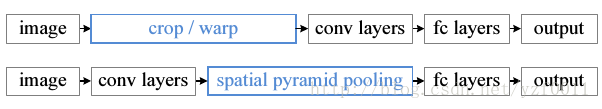

        *   将输入特征图划分成不同大小的子区域（即不同层次的金字塔）
        *   并在每个子区域内进行池化操作。
        *   然后，将这些池化结果进行拼接，形成固定长度的特征向量。

*   图像语义分割算法

    *   编码-解码结构

        *   图像的转换过程根据先后顺序可以分为两个阶段：

            *   第一阶段为图像的特征提取过程，可以理解为编码过程，即对图像中的区域进行拆分与编码以方便后续的操作；
            *   第二阶段为特征映射过程，把低分辨率的编码特征映射为高分辨率，该阶段过程可以视为解码过程。

        *   一般地，编码由骨干网络（深度卷积神经网络）实现，是一个下采样过程

        *   解码则采用反卷积或双线性插值等一系列上采样操作恢复原图分辨率。

        *   编码-解码结构可以有效地捕捉图像的全局和局部信息，适用于自动驾驶场景理解任务。

    *   注意力机制

        *   注意力机制是一种解决信息超载问题的资源分配方案，可以提高网络模型对输入数据的处理效率和准确性

        *   输入序列通过线性变换映射成为三个序列向量，分别为 Q（query），K（key）和V（value）。Q和K计算相关性，即计算V的不同的权重系数，然后V的加权平均结果作为注意力值。$\mathrm{Attention}(Q,K,V)=V\times\mathrm{Similarity}(Q,K)\\\mathrm{Similarity}(Q,K)=softmax(\frac{QK^{T}}{\sqrt{d_{k}}})$

            *   查询向量Q用来表示需要关注的目标；键向量K用来表示输入特征的某种查询特征；值向量V用来表示输入特征的内容。

        *   注意力机制能够捕获特征图中不同位置之间的空间依赖关系，并获取长距离上下文依赖信息，从而提高语义分割的性能。

        *   该机制使用通道分支和空间分支来增强不同通道和不同空间位置的特征，最终将两个分支的结果融合，显著提高了特征图的表达能力和准确率。

    *   知识蒸馏

        *   语义分割中的知识蒸馏是指将一个较大的、复杂的模型（“教师模型”）的知识转移给一个较小、更简单的模型（“学生模型”），以便学生模型可以在相同或更快的速度内达到类似的性能。旨在提高学生模型的泛化性能和鲁棒性，并减少过拟合，它可以通过两种不同的方式进行：软目标知识蒸馏和硬目标知识蒸馏。
    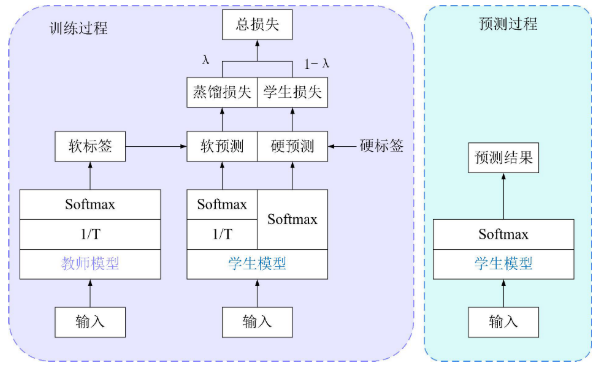
            *   软目标知识蒸馏是指将教师模型的概率分布作为学生模型的目标输出，并使用温度参数 T（通常为 1 或小于 1）来调整概率分布的形状。

                *   带“温度”的softmax：$p_i=\frac{\exp(z_i/T)}{\sum_{j=0}^k\exp(z_i/T)}$​
        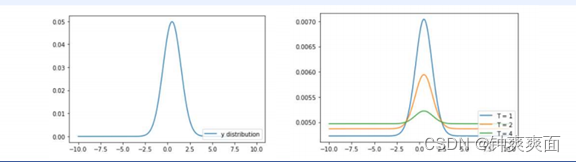
                    *   T越高，softmax的输出概率分布越趋于平滑，其分布的熵越大，负标签携带的信息会被相对地放大，模型训练将更加关注负标签。

            *   硬目标知识蒸馏是指将真实标签作为学生模型的目标输出。这种方法可以帮助学生模型更快地收敛，并产生更具针对性的结果。

        *   知识蒸馏将教师模型和学生模型联合起来一起训练，共同优化蒸馏损失和学生损失以实现通过教师模型提升学生模型的学习效果

    *   传统的图像分割方法

        *   包含基于阈值的图像分割方法、基于边缘的图像分割方法、基于区域的图像分割方法、基于聚类的图像分割方法和基于图论的图像分割方法，5 种。
        *   传统方法依赖于人为的特征提取设计，主观因素占据主导地位，容易忽略客观事实。
        *   这些方法的分割效果差，分割效率也比较低下，难以应用于实时的自动驾驶场景中。

    *   基于深度学习的图像语义分割方法

        *   全卷积网络（FCN）

            *   FCN 中不包含全连接层，全部都为卷积或池化层，可以处理任意分辨率的图像。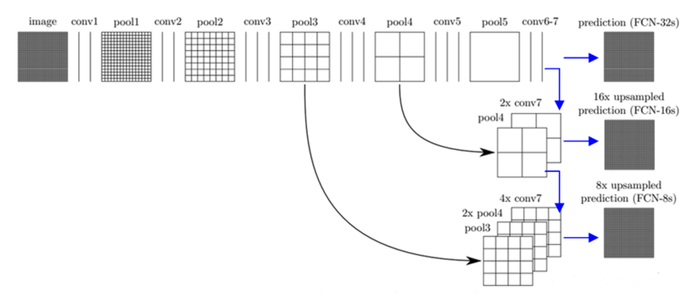

            *   图像进入特征提取模块后首先经历多个卷积和池化层，每一次的下采样都会导致特征图的分辨率缩小为之前的 1/2，相当于扩大了感受野，同时也提取到了更加精细的特征。在经历了 5次下采样后特征图的分辨率已经变为初始的 1/32，此时产生了高维特征图，称之为热图（Heatmap）。

            *   对 conv6-7 的特征图直接进行 32 倍的上采样（转置卷积）可以得到FCN-32S。但是 FCN-32S 特征图信息少，分割结果较差，于是将融合后的特征图进行上采样。特征融合模块将叠加后的特征图进行 2 倍的上采样，然后继续叠加，根据上采样的倍数不一样分为 FCN-8S、FCN-16S、FCN-32S。

            *   但是 FCN网络得到的结果还是不够精细，没有充分考虑像素与像素之间的关系，缺乏空间一致性，并且 FCN网络在不同尺度上的特征融合方式比较简单，没有考虑不同尺度特征之间的权重和相互作用，进行上采样的过程中会丢失一些细节信息，对图像中的小物体和边界不敏感。

        *   DeepLab系列 
            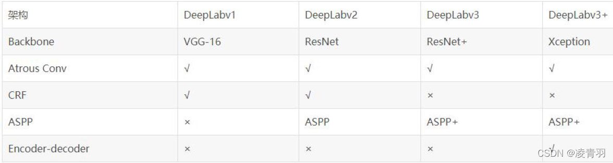
            *   DeepLab v1 (2014)

                *   主要创新：

                    *   空洞卷积 (Atrous Convolution)
                    *   全连接条件随机场 (Fully Connected Conditional Random Fields, FC-CRF)

                *   空洞卷积（Atrous Conv）：

                    *   语义分割是一个像素级的预测问题，图片进入到神经网络后进行卷积及池化一系列操作，降低特征图的尺寸同时也可以增加感受野，但是会导致一个严重的问题发生：图像的细节信息大量丢失，小物体信息不能够重建。

                    *   空洞卷积（Dilated Convolution）是针对上述问题而提出的一种新的卷积思路 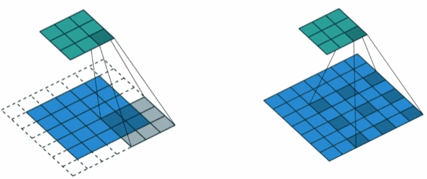

                    *   空洞卷积在卷积核中引入扩张率（Dilation Rate）这一参数使得尺寸大小相同的卷积核能够获得更大的感受野。

                        *   扩大感受野：

                            *   空洞卷积在不增加参数量的情况下显著扩大了卷积核的感受野。例如，扩张率为 2 的 3x3 卷积核的感受野相当于 5x5 的标准卷积核，而扩张率为 4 的 3x3 卷积核的感受野相当于 9x9 的标准卷积核。

                        *   保留分辨率：

                            *   传统的池化操作（如最大池化或平均池化）通过下采样来增加感受野，但这会导致特征图分辨率的降低，从而丢失图像的细节。空洞卷积通过引入间隔，在不进行下采样的情况下增加感受野，从而保留了特征图的高分辨率。

                        *   重建小物体细节：

                            *   在语义分割任务中，小物体的细节信息容易在下采样过程中丢失。空洞卷积可以在高分辨率的特征图上操作，从而更好地保留和重建小物体的细节信息。

                        *   空洞卷积的优势：

                            *   图像分割任务中（其他场景也适用）需要较大感受野来更好完成任务
                            *   通过设置dilation rate参数来完成空洞卷积，并没有额外计算
                            *   可以按照参数扩大任意倍数的感受野，而且没有引入额外的参数
                            *   应用简单，就是卷积层中多设置一个参数就可以了

                *   全连接条件随机场 FC-CRF：

                    *   条件随机场（CRF）是一种用于序列标注和结构预测的概率图模型，通常用于建模输入数据之间的依赖关系和条件概率分布。对于图像分割问题，CRF 的目标是基于像素特征和上下文信息，为每个像素分配正确的标签。

                        *   节点特征（Unary Potentials）：

                            *   也称为能量项，表示独立于其他像素的每个像素所属标签的概率。通常由深度神经网络（如卷积神经网络，CNN）预测的类概率来定义。

                        *   边缘特征（Pairwise Potentials）：

                            *   表示像素之间的相互关系或相似性，帮助维持邻近像素的标签一致性。传统 CRF 中，这通常仅限于相邻像素的交互。

                    *   在 FC-CRF 中，每个像素都与所有其他像素连接。这样，模型不仅仅局限于捕捉局部特征，而是可以综合全局信息。

                    *   节点能量：表示给定输入图像条件下，像素 i 被分配到类别标签 $x_i$的代价。由深度神经网络预先计算的分类概率的负对数值：$\psi_u(x_i) = -\log P(x_i | \text{image})$

                        *   其中，$P(x_i | \text{image})$是像素 i 被分配到类别$x_i$​ 的概率。

                    *   边缘能量：

                        *   边缘能量 $\psi_p(x_i, x_j)$表示像素 i和像素 j 分别被分配到标签 $x_i$和 $x_j$ 的代价。它的作用是鼓励相似的像素获得相同的标签，同时也允许不同类别之间的边界清晰。边缘能量的计算基于像素特征的相似性，如颜色、位置等。通常可以表示为：$\psi_p(x_i, x_j) = \mu(x_i, x_j) k(f_i, f_j)$

                            *   其中，$\mu(x_i, x_j)$是一个权重函数，通常取决于标签$x_i$和$x_j$是否相同；$k(f_i, f_j)$是一个核函数，用于衡量像素特征$f_i$和$f_j$的相似性（通常基于像素之间的颜色、空间等相似度）

                    *   能量函数：由节点特征和边缘特征组成：$E(x) = \sum_{i} \psi_u(x_i) + \sum_{i<j} \psi_p(x_i, x_j)$​

                    *   通过最小化能量函数 E(x)来找到最优的标签分配。

                    *   优势：改善了分割的精细度,尤其是对象边界。

                    *   缺点：计算成本较高,难以端到端训练。

            *   DeepLab v2 (2016)

                *   主要创新：

                    *   空洞空间金字塔池化 (Atrous Spatial Pyramid Pooling, ASPP)
                    *   使用深度残差网络 (ResNet) 作为骨干网络

                *   ASPP详解：

                    *   概念：使用不同膨胀率的空洞卷积并行采样特征图。捕获多尺度上下文信息，适应不同大小的目标。

                    *   结构：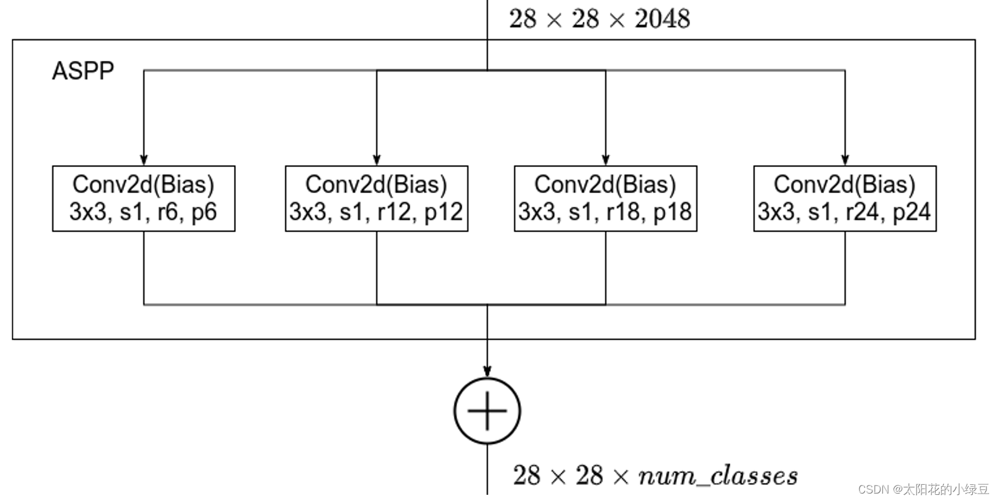

                    *   优势：

                        *   有效捕获多尺度信息。
                        *   增强模型对不同尺寸物体的适应性。
                        *   保持较低的计算复杂度。

                *   ResNet作为骨干网络：

                    *   ……

                    *   优势：

                        *   缓解深度网络的梯度消失问题。
                        *   允许训练更深的网络，提高特征提取能力。

            *   DeepLab v3 (2017)

                *   主要创新：

                    *   改进的ASPP模块
                    *   多网格方法 (Multi-grid Method)
                    *   去除CRF后处理

                *   改进的ASPP模块：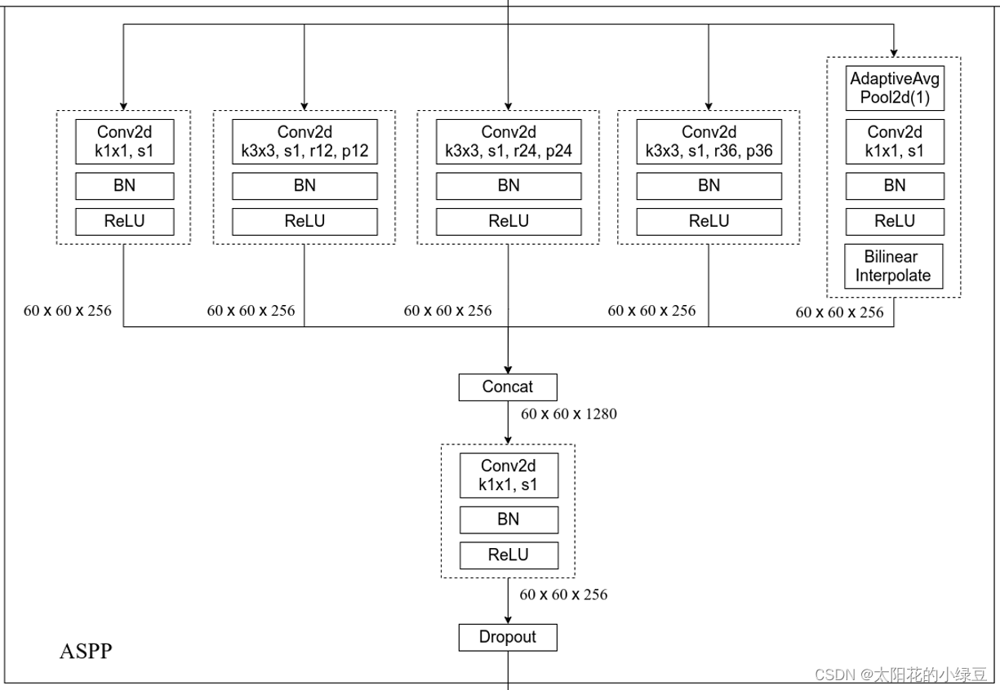

                    *   变化：使用了不同的扩张率，加入全局平均池化分支。

                    *   实现步骤：

                        *   对特征图进行全局平均池化，生成了一个全局的上下文特征，之后再通过1x1卷积调整通道数并上采样到与其他特征图一致的大小，增强全局信息的表达能力。
                        *   ASPP 中的每一个分支加入了批归一化

                    *   目的：捕获全局上下文信息。

                *   多网格方法：在最后几个残差块中使用不同膨胀率的卷积，进一步增大感受野,捕获更丰富的上下文信息。

                    *   通常使用递增的膨胀率序列，对于第i个残差块，其膨胀率为：$rate_i = rate * multi_{grid}[i]$

                        *   其中rate是基础膨胀率，multi\_grid是预定义的网格序列。

                *   去除CRF后处理：

                    *   原因：CRF计算成本高,难以端到端训练。
                    *   替代方案：通过改进的网络结构直接输出高质量分割结果。

            *   DeepLab v3+ (2018)

                *   主要创新：

                    *   编码器-解码器结构
                    *   Xception骨干网络
                    *   深度可分离卷积

                *   编码器-解码器结构：

                    *   编码器：使用DeepLab v3作为特征提取器。

                    *   解码器：

                        *   对编码器输出上采样(通常4倍)
                        *   连接低层特征(通常来自骨干网络的早期层)
                        *   3x3卷积进行特征融合
                        *   再次上采样到原始图像大小

                    *   优势：

                        *   更好地恢复对象边界细节。
                        *   结合了高级语义信息和低级细节特征。

                *   深度可分离卷积：

                    *   传统卷积：输入图片尺寸为12×12×3，用256个5×5×3的卷积核进行卷积操作，会得到8×8×256的输出

                        *   参数计算：256×5×5×3 = 19200

                    *   概念：将标准卷积分解为深度卷积和逐点卷积。

                        *   深度卷积：对输入的每个通道单独进行卷积。每个5×5×1的卷积核对应输入图像中的一个通道，得到三个8×8×1的输出，拼接后得到8×8×3的结果

                        *   逐点卷积：使用1x1 卷积核对深度卷积的输出进行卷积。设置256个1×1×3的卷积核，对深度卷积的输出再进行卷积操作，最终得到8×8×256的输出

                            *   参数计算：

                                *   深度卷积参数 = 5×5×3 = 75
                                *   逐点卷积参数 = 256×1×1×3 = 768
                                *   总参数 = 75 + 768 = 843 << 19200

                *   Xception骨干网络：

                    *   核心思想：极致地将空间特征学习和跨通道特征学习分离，使用深度可分离卷积替代标准卷积；采用残差连接来促进梯度流动。

                    *   结构：

                *   编码器-解码器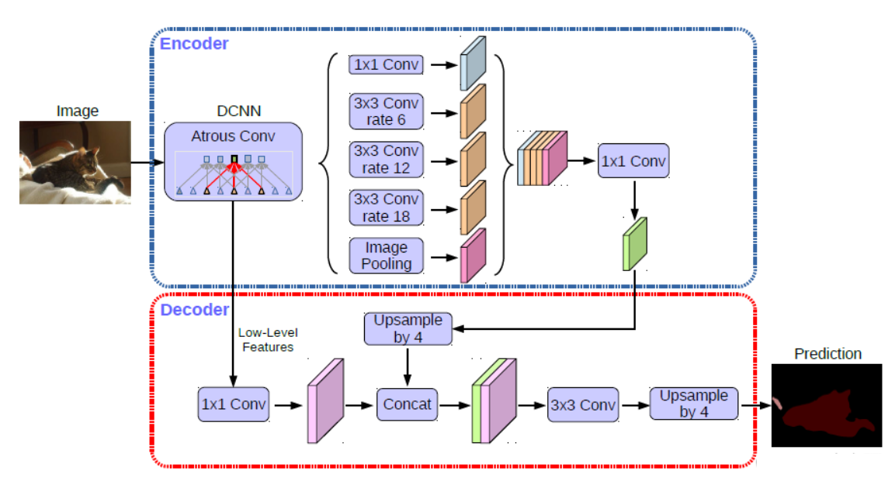

                    *   编码器：

                        *   使用DeepLab v3作为编码器结构，输出与输入尺寸之比为16(output\_stride = 16)
                        *   ASPP：一个1×1卷积 + 三个3×3卷积(rate = {6, 12, 18}) + 全局平均池化

                    *   解码器：

                        *   先把encoder的结果上采样4倍，然后与编码器中相对应尺寸的特征图进行拼接融合，再进行3x3的卷积，最后上采样4倍得到最终结果
                        *   融合低层次信息前，先进行1x1的卷积，目的是降低通道数

***

## 高准确率语义分割算法研究

*   传统的语义分割模型框架通常使用ResNet 作为骨干网络，这可以使网络深度增加，提取出非常精细的细节信息。但是连续对输入图像进行下采样后再恢复原始分辨率时，会导致大量有效信息的丢失，从而影响最终的分割结果。

*   为了减小这种不良影响，本章采用了 HRNet作为骨干网络，OCRNet作为分割算法二者结合形成网络模型框架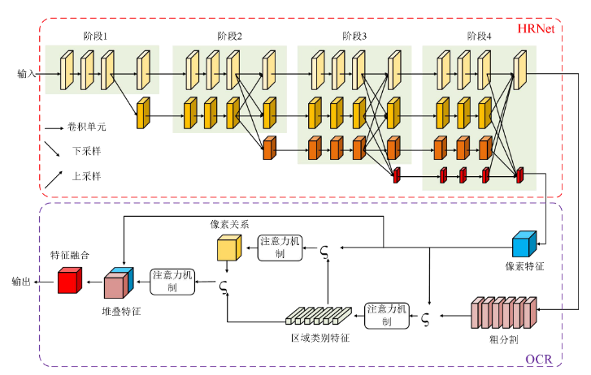

*   HRNet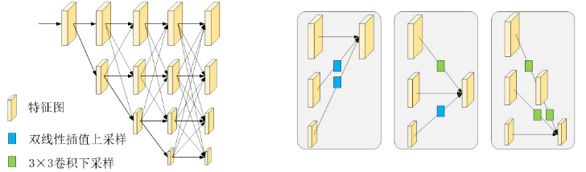

    *   HRNet 是一种高分辨率网络，与ResNet 不同，它不会连续对输入图像进行下采样。相反，HRNet 将高分辨率和低分辨率并行排列，并且相互交错连接，交叉融合不同分辨率的特征信息。

    *   HRNet 的主要组成部分就是其交换单元，主要特点就是能够实现不同分辨率特征图的转换。

        *   高分辨率转换为低分辨率的操作是大小为 3×3，步长为 2 的卷积
        *   低分辨率转换为高分辨率的操作是双线性插值

    *   改进的上采样模块

        *   原始的HRNet 使各个通道的特征图并行串联融合，但是没有考虑到不同通道之间的不同分辨率的特征图的重要程度不一样，例如对极小的特征图直接上采样恢复至原始分辨率可能会产生比较差的效果。

        *   于是需要对不同通道之间的特征图进行一个权重考虑，可以增大重要通道的权值和缩小没有显著效果的通道的权值，提升重要特征的占比，实现特征提取的效果提升。

        *   SENet注意力机制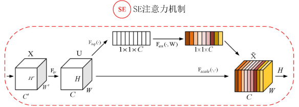

            *   SENet是一种用于提高卷积神经网络性能的注意力机制。它通过显式建模各个通道之间的依赖关系，增强了网络的特征表示能力。SE模块的主要操作包括 Squeeze和Excitation，其计 算过程如下：

                *   输入特征图为$X \in \mathbb{R}^{H \times W \times C}$，$U$​ 是HRNet 并行卷积流输出的特征图

                *   Squeeze 操作 $F_{sq}()$

                    *   Squeeze操作通过全局平均池化将每个通道的空间信息聚合为一个全局描述，生成一个通道描述向量$\mathbf{z} \in \mathbb{R}^C$。$z_c = F_{sq}(u_c) = \frac{1}{H \times W} \sum_{i=1}^{H} \sum_{j=1}^{W} \mathbf{X}_{i,j,c}$

                *   Excitation 操作 $F_{ex}()$

                    *   Excitation操作通过两个全连接层生成每个通道的权重因子 $\mathbf{s} \in \mathbb{R}^C$$\mathbf{s} = \sigma(\mathbf{W}_2 \delta(\mathbf{W}_1 \mathbf{z}))$

                        *   其中，$\delta(\mathbf{W}_1)$和$\sigma(\mathbf{W}_2)$是两个全连接层的权重矩阵，分别用ReLU和Sigmoid作为激活函数。

                *   重新标定特征图

                    *   通过元素级别的乘法操作，将每个通道的权重因子重新分配给对应的通道，从而重新标定原始特征图。$\tilde{x}_c=\mathrm{F}_{scale}(u_c,s_c)=s_cu_c$

        *   对上采样过程加入 SENet 注意力机制，为特征图的各个通道赋予不同的权重，增强语义分割任务相关像素的权重，弱化噪声及其它干扰项的影响，从而还原更加准确的细节信息。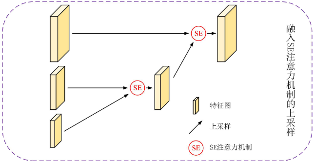

    *   改进的连接方式

        *   为了实现特征传输过程中细节信息的保留，对 HRNet 的连接方式进行改进，引入了密集连接，使得浅层网络中的细节信息可以传输给深层网络。密集连接可以对浅层网络与深层网络的信息取长补短，并且提升了神经网络梯度的反向传播能力，模型变得更加容易训练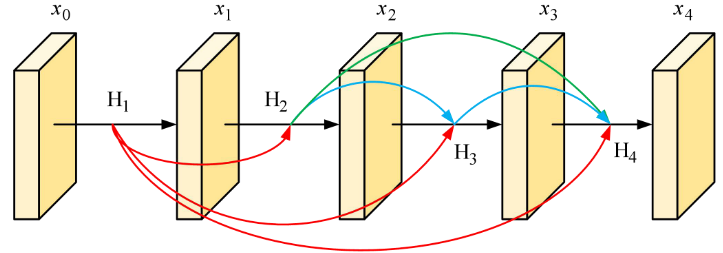

            *   若分辨率支路的深度为 l 层，各个特征图用 x 表示，那么密集连接的输出可以表示为$x_l=\mathrm{H}_l([x_0,x_1,x_2,x_3,\cdots,x_{l-1}])$

                *   $x_l$

                    是输出的特征图， $[x_0,x_1,x_2,x_3,\cdots,x_{l-1}]$是指将前面所有曾的输出特征图在通道维度上拼接起来。

                *   $H_l(x)$

                    代表非线性转换函数，具体为 BN、ReLU、1×1 卷积、2×2平均池化操作。通过 1×1 卷积层来减小通道数，并使用步幅为 2 的平均池化层减半高和宽，从而进一步降低模型复杂度。

    *   改进的空洞空间金字塔池化模块

        *   HRNet 的原始卷积结构不能够很好地提取多尺度特征信息，于是本文对 HRNet的卷积结构进行改进，融入空洞空间金字塔池化模块（ASPP），增大卷积核的感受野从而从多个尺度提取物体的特征。

        *   前文提到了空洞卷积能够增大感受野，但是它也带来了网格问题和局部信息丢失等问题。

        *   本文提出了一种改进的ASPP 模块：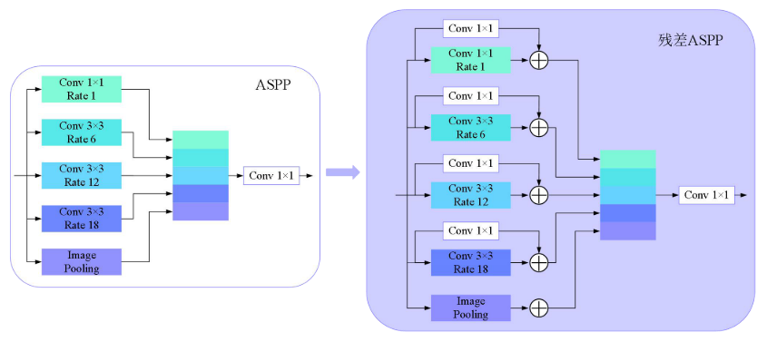

            *   采用残差结构的思想，并在 3×3 卷积的基础上增加一个 1×1 的跳跃连接。

        *   这种改进不仅可以提取图像特征，还可以保持图像的分辨率不变，从而更好地进行多尺度的特征信息提取，可以增大特征图的感受野，使得特征图可以覆盖更大范围的目标信息。

        *   此外，根据不同的空洞率，还可以提取多种尺寸的感受野，从而有效地解决对于不同大小目标的分割问题，改进的ASPP 模块在多尺度信息提取和目标分割方面都有较好的效果，且可以有效地避免空洞卷积带来的网格问题和信息丢失

*   OCRNet（目标上下文特征网络）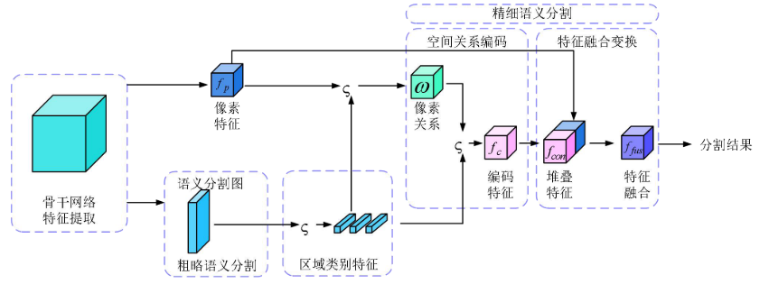

    *   OCRNet 对像素自身的局部范围分析计算，考虑像素点与目标类别之间的相关性，并且利用骨干网络提取到的特征信息，加强像素之间的联系，提升分割的准确率。

    *   分割算法包含了两个分支，一种是粗略分割，一种是精细分割。

        *   粗语义分割分支为精细语义分割分支提供了基本的特征信息和类别信息，并以此编码建立像素之间的空间联系，融合空间区域内的像素信息，提高像素的特征表达能力；
        *   精细语义分割分支基于增强的像素可以实现高准确率的分割效果。

    *   具体分割逻辑为：

        *   首先，提取类别区域特征，根据骨干网络提取到的像素语义信息和像素特征可以计算每个类别区域特征(粗略分割)；
        *   然后，根据像素特征和区域特征计算二者的相关性，即依赖关系；
        *   最后，对相关性和像素特征拼接即可得到每个像素点最终的表达，即实现高准确率分割(精细分割)。

    *   计算过程

        *   提取初步特征：

            *   输入图像$I \in R^{H \times W \times C}$通过主干网络 HRNet 提取初步特征$f_b$。

            *   将 $f_b$上采样并卷积得到像素特征图$f_p$。$f_b = \mathrm{backbone}(I)\\f_p = \mathrm{upsample}(f_b)$

        *   粗语义分割：

            *   粗语义分割模块生成粗分割图$f_{corse}$，并计算粗分割损失$L_{corse}$。$f_{corse} = \mathrm{branch\text{-}corse}(f_b)\\L_{corse} = \mathrm{CrossEntropy}(f_{corse}, Y)$

        *   类别中心特征计算：

            *   根据粗分割图$f_{corse}$，将每个类别的像素特征平均，计算类别中心特征$f_{centor}$。$f_{centor,c} = \frac{1}{|P_{c}|} \sum_{i \in P_{c}} f_{p,i}$

        *   精细语义分割：

            *   使用类别中心特征$f_{centor}$和像素特征$f_p$计算亲和性权重$\omega_{i,k}$。

            *   通过权重$\omega_{i,k}$对类别中心特征加权平均，得到新的编码特征 $f_c$。$\begin{gathered} \kappa(a,b)=\varphi(a)^{\mathrm{T}}\psi(b) \\ \omega_{i,k}=\frac{\kappa(f_{centor,k},f_{p,i})}{\sum_{j=1}^{Cla}\exp(\kappa(f_{centor,j},f_{p,i}))} \\ f_{c,i}=\rho\left(\sum_{j=1}^{Cla}\omega_{i,j}\sigma(f_{centor,j})\right) \end{gathered}$

                *   $\kappa(x)$

                    表示为距离函数；

                *   $\varphi(x)$

                    ，$\psi(x)$，$\sigma(x)$，$\rho(x)$为转换函数，具体的操作是 1×1 卷积层-BN归一化层-ReLU 层；

                *   $\omega_{i,k}$

                    为像素关系矩阵中的元素，表示第 i 个像素和第 k个类别的权重；

                *   $f_{c,i}$

                    ​表示第 i 个像素的编码特征

        *   融合特征：

            *   将像素特征$f_p$和编码特征$f_c$进行融合，得到最终的融合特征$f_{fus}$。

            *   将融合特征通过卷积层得到最终精细分割结果$f_{fine}$$f_{fus} = g(f_p, f_c)\\f_{fine}=\mathrm{conv}_{1\times1}(f_{fus})$​

                *   $g(x)$

                    为将两个特征图进行叠加，然后通过 1×1 卷积层-BN 归一化层-ReLU层。

        *   损失计算：

            *   计算精细分割损失 $L_{fine}$，最终的总损失为结合粗分割损失和精细分割损失之和。$L_{fine}=\mathrm{CrossEntropy}(f_{fine},Y)\\L=L_{fine}+\lambda L_{corse}$

*   实验设计与结果分析

    *   对比实验

        *   在 Cityscapes 数据集选择FCN、DeepLabv3、DeepLabv3+作比较

            *   损失值收敛效果相似，但对比方法的收敛速度稍快于本章方法。

                *   FCN、DeepLabv3 和 DeepLabv3+所采用的骨干网络都是ResNet，并且 PIDNet 的骨干网络经过优化设计，而我们采用的方案的是HRNet。HRNet 相较于ResNet 多了一些上下连接的卷积操作，使得计算稍微复杂，在收敛过程中可能不太占优势

            *   本文算法在整个数据集上的分割效果优于对比算法

                *   尤其对驾驶场景中的大目标分割效果有显著提升，例如人、汽车、卡车、公交车和自行车。

                *   在围墙、栅栏、骑手和地面(裸露的、没有被植物覆盖的土地)等几类的分割效果不好，低于分割准确率的平均值。

                    *   原因是在该数据集中，这几类物体的出现频率较少，所占比重很低，模型没有学习到这几类物体的特征。该结果也符合驾驶场景的实际情况，围墙、栅栏和地面(裸露的、没有被植物覆盖的土地)这几类物体在常规的城市行车环境中出现的概率很低，它们同时出现的场景多为乡村小路，而一般的乡村小路很难具备行车条件。

    *   消融实验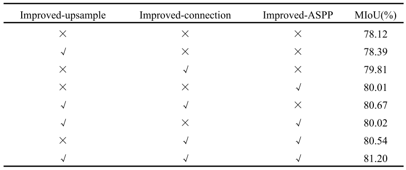

        *   消融实验结果表明这些改进模块是有效的，并且可以显著提高分割的准确率。

## 实时语音分割算法研究

*   目前的语义分割网络更多地关注于如何提高分割精度，却忽略了模型效率的问题，导致现有的准确率语义分割网络存在参数过多、计算资源消耗高等缺点。而应用场景的计算资源有限，高精度的语义分割模型无法满足实时要求。因此，在日益增长的智能场景理解需求下，迫切需要开发实时语义分割网络。

*   本章重点研究实时语义分割算法，对影响模型分割速度的因素进行分析，旨在提高语义分割的速度，以满足实时需求。优化网络结构，目的是在保持可接受精度水平的同时提高语义分割速度以满足实时要求。

*   实时语义分割方案

    *   改进的知识蒸馏训练方法

        *   把语义分割当作独立的像素标签集合，直接利用知识蒸馏策略调整学生模型 T 输出的每个像素类别，即利用教师模型 T 产生的类别概率值当作软目标来训练学生模型 S

        *   本节将教师模型选定为已经训练好的HRNet-W48，学生模型设置为HRNet-W18

        *   训练过程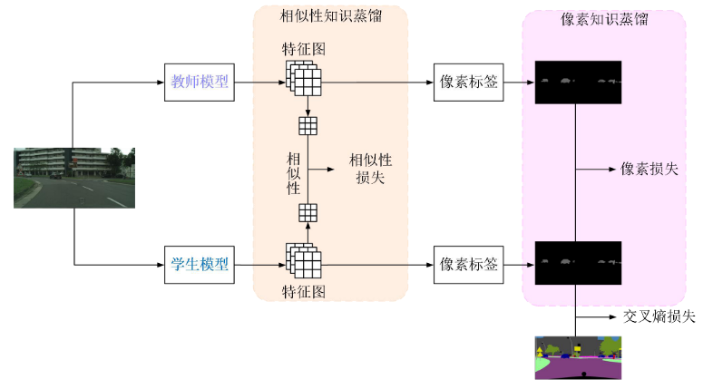

            *   相似性知识蒸馏

                *   教师模型和学生模型接收到的图片是完全相同的，所以二者产生的特征图具有一定的相关性，于是从它们的相关性入手并优化该相似性损失，可以使得学生模型向教师模型靠拢，逐渐逼近教师网络，得到与教师网络相近的结果$l_{pa}(S)=\frac{1}{\left(H\times W\right)^{2}}\sum_{i\in R}\sum_{j\in R}\left(a_{ij}^{s}-a_{ij}^{t}\right)^{2}$

                    *   $a_{ij}^s$

                        和$a_{ij}^t$分别表示学生模型和教师模型产生的第 i 个和第 j 个像素点之间的相似性，

            *   像素知识蒸馏

                *   相似性知识蒸馏可以增大网络模型之间的相关性，但是仍需要对最终的分割目标像素点进行操作，才能保证分割效果的提升。

                *   本文在第二阶段利像素知识蒸馏方法，分别对教师模型和学生模型的像素点输出值计算损失，通过优化该损失以实现学生模型最终的分割效果的提升。

                *   本文利用KL 散度作为像素知识蒸馏的损失值$l_{pi}(S)=\frac{1}{H\times W}\sum\limits_{i\in R}KL(q_i^s\mid\mid q_i^t)=\frac{1}{H\times W}\sum\limits_{i\in R}q_i^s\log\frac{q_i^s}{q_i^t}$

                    *   $KL(\cdot)$

                        是KL 散度函数，$q_i^s$是学生模型输出的第 i 个像素点的类别概率值，$q_i^t$​是教师模型 T 输出的第 i 个像素点的类别概率值。

    *   改进的实时语义分割框架

        *   改进了一种轻量化语义分割网络框架。基于编码-解码结构，通过使用一个轻量级网络作为编码器，从输入图像中提取出不同层次的特征，并对其进行了多方面的优化，以减少参数量和计算复杂度，同时保证分割精度。该框架具有足够的轻量化特性以满足实时分割的要求，同时通过改进网络结构和算法，提高了分割准确度和速度。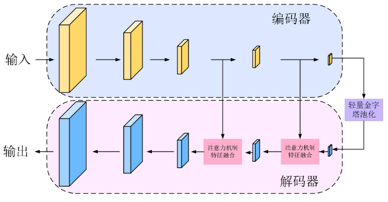

    *   改进的灵活解码器模块

        *   语义分割模型分为编码器和解码器。在编码器模块中，随着网络层次的加深，提取到的语义信息越丰富，网络的通道数也逐渐增多，解码器模块需要对提取到的特征信息进行放大与还原。

        *   但是解码器模块在还原特征信息的过程中其通道数为一个固定值，并没有像编码器模块那样网络通道数随着网络层次而变化。这就导致了两个问题：

            *   解码器模块一直以多通道数进行计算，浪费计算资源，产生计算冗余。
            *   解码环节与编码环节不能一一对应，解码效果差。

        *   改进示意图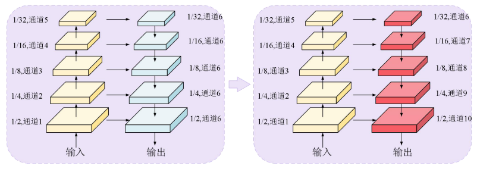

            *   在原解码器模块中，每一阶段的通道数量都是固定的 128。而改进后的灵活解码器模块则根据编码器模块的通道数量进行调整，分别为 128、112、96、80 和 64。
            *   改进后的灵活解码器模块由 5 个子模块组成，每个子模块都包含一个双线性插值的上采样操作和融合操作，具体为 1×1 的卷积将特征图的通道数减半并与编码器中对应层次的特征图相加。
            *   这样的改进可以平衡编码器模块和解码器模块之间的关系，并且随着网络通道数量的减少，整个网络模型的计算效率得到提升。这不仅缩短了网络模型的训练时间，还加快了其推理速度。
            *   同时，这种灵活解码器模块还能更好地满足语义分割任务的需求，能够更好地还原图像特征，从而提高分割精度。

    *   改进的注意力机制特征融合模块

        *   在语义分割中，利用特征融合的方法可以强化提取的特征信息。

        *   因为注意到空间和通道是两种不同的维度，于是本节提出了一种利用空间注意力机制和通道注意力机制进行特征融合的模块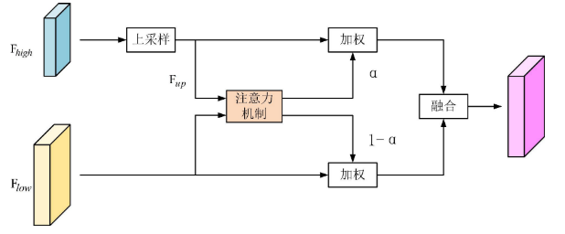$F_{up}=Upsample(F_{high})\\\alpha=Attention(F_{up},F_{low})\\F_{out}=F_{up}\cdot\alpha+F_{low}\cdot(1-\alpha)$

            *   空间注意力机制输出的权重表示的是空间维度每个像素在融合过程中的重要性$F_{cat}=Concat(Max(F_{up}),Max(F_{low}))\\\beta=Sigmoid(Conv(F_{cat}))$

                *   在空间注意力机制中，深层次的特征图$F_{up}$和浅层次的特征图$F_{low}$都属于一个集合$R^{C \times H \times W}$。首先进行一个最大池化操作来产 2 个维度为$R^{1 \times H \times W}$的特征，然后再将这 2 个特征拼接为一个特征$F_{cat} \in R^{2 \times H \times W}$，该特征经过卷积和 sigmoid 函数后输出空间权重$\beta \in R^{1 \times H \times W}$

            *   通道注意力机制的计算流程和空间注意力机制的计算流程相似，但是其操作的维度不同，通道注意力机制是针对通道进行计算，利用不同通道间的关系来产生权重。$C_{cat}=Concat(Max(C_{up}),Max(C_{low}))\\\gamma=Sigmoid(Conv(C_{cat}))$

                *   $C_{up}$

                    和$C_{low}$分别代表$F_{up}$和$F_{low}$的通道，$C_{cat} \in R^{1 \times 1 \times 1}$表示两者融合后的通道，$\gamma \in R^{C \times 1 \times 1}$表示通道的权重。

*   改进的轻量金字塔池化模块 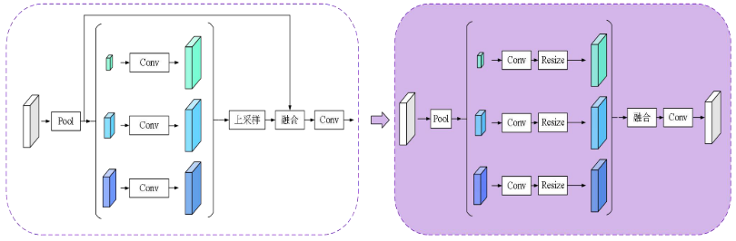

    *   取消了原金字塔池化模块的跳跃连接，改变了中间过程特征图的计算方式，使上采样操作在该阶段发生。
    *   轻量金字塔池化模块有 3 个池化操作，池化大小分别为 1×1，2×2 和 4×4。输入特征图通过该轻量金字塔池化模块后产生 3 个不同的特征图
    *   再对这 3 个特征图进行卷积和上采样操作，使其保持同样的分辨率。该过程的卷积核大小为 1×1，输出的通道数小于之前的通道数。
    *   最后，将 3 个特征图融合并进行卷积，以产生最终的特征图。
    *   本节改进的轻量金字塔池化模块比原始的金字塔池化模块减少了通道数，简化了计算方式，这种设计有助于提高模型的性能和准确度。该模块可以作为轻量化模型的基础组件，提供更高的运行效率和更小的模型体积，适合轻量化网络的运行。

*   实验分析

    *   改进的语义分割知识蒸馏有效性验证

        *   HRNet-W48 模型作为教师模型，选取了参数量相对较小的三个学生模型，ResNet18、MobileNetv3 和HRNet-w18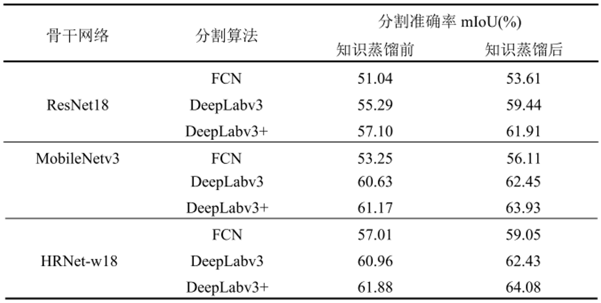

        *   无论是使用不同的骨干网络还是不同的分割算法，知识蒸馏都能有效提升分割模型的准确率

        *   更复杂的算法更能从知识蒸馏中获益，DeepLabv3 和DeepLabv3+比使用 FCN算法提高的准确率更多

    *   改进的注意力机制特征融合模块有效性验证

        *   使用本章模型与U-Net展开实验，验证改进注意力机制的有效性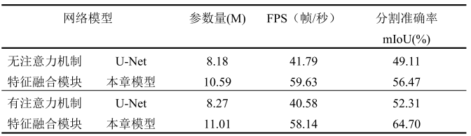

        *   通过加入注意力机制特征融合模块，本章模型分割准确率提升约 3.5 个百分点，并且没有降低过多的分割速度，

    *   改进的轻量金字塔池化模块有效性分析

        *   使用本章模型与DeepLabv3、v3+展开实验，验证轻量金字塔池化模块的有效性 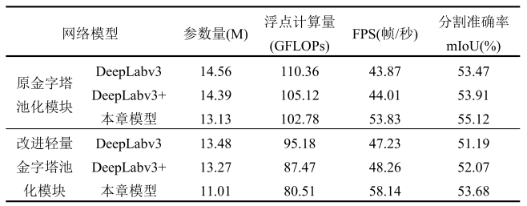

        *   对三种模型，轻量金字塔池化模块在改善网络模型的计算方式，降低模型整体的计算量方面有着显著的效果。对于本章模型浮点计算量降幅达到 21.56%，帧率提升了约 4 帧，而分割准确率仅仅下降了2.49%mIoU

    *   与其它方法综合对比 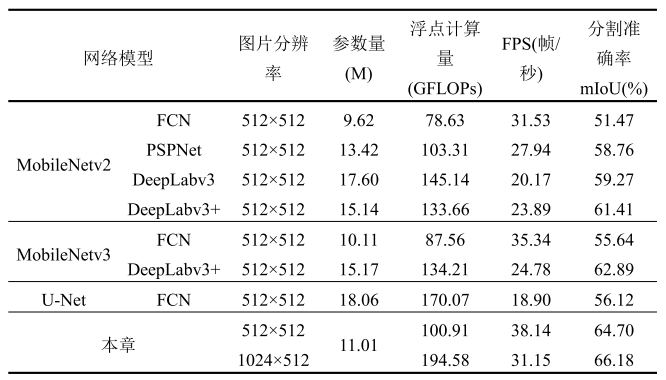相比其他模型本章模型在分割准确率和分割速度上均实现了提升。

## 驾驶场景语义分割系统设计与实现

*   系统框架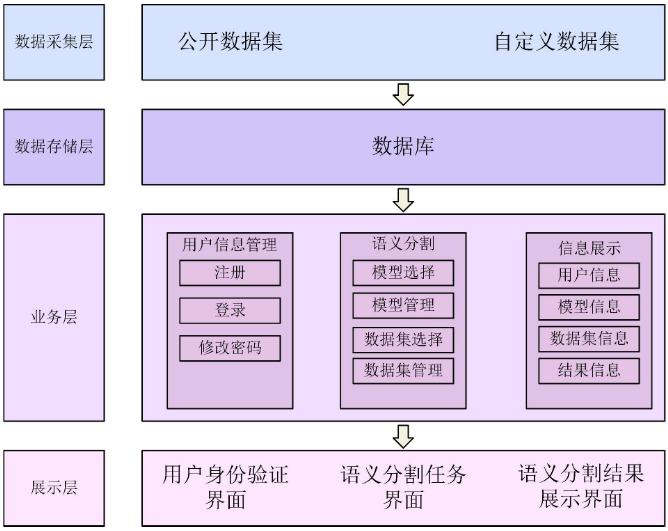
